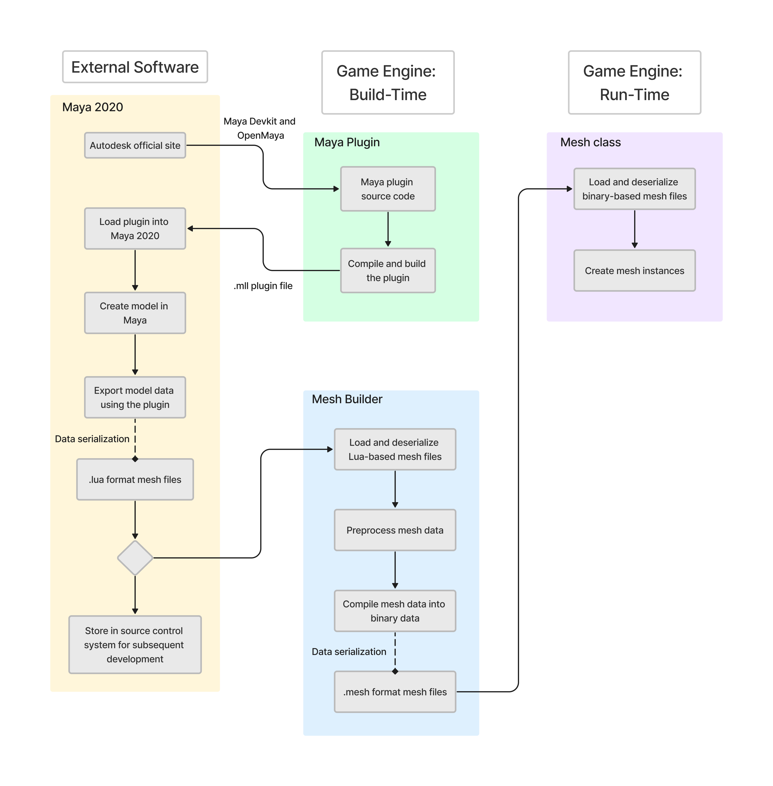

# 3D Game Engine

## Introduction

A lightweight game engine that is developed by C/C++ and targeted on the Windows operating system. The systems and components of this game engine include:

- **Cross-platform rendering pipeline**
- **Art asset pipeline**
- **Job system**
- **Maya plugin**
- **Utility components**
- **Math library**

Read this in other languages:
[简体中文](README.zh-CN.md)

  

## Catalog

+ [Graphics Library](#GraphicsLibrary)
+ [Rendering Pipeline](#RenderingPipeline)
+ [Asset Pipeline](#AssetPipeline)
+ [Job System](#JobSystem)
+ [Maya Plugin](#MayaPlugin)
+ [Utility](#Utility)
    - [Singleton](#Singleton)
    - [Smart Pointers](#SmartPointers)
+ [Math](#Math)
    - [Mathf](#Mathf)
    - [Vector](#Vector)
    - [Matrix](#Matrix)
+ [Future Plan](#FuturePlan)

- Designed to seamlessly run on both the x64 and Win32 platforms. Developed using Direct3D for x64 platfrom and OpenGL for Win32 platform.
- Comprehensive support for both GLSL and HLSL.
- Developed platform-specific rendering components such as "mesh" and "effect" representations. Developed platform-independent interfaces for inter-system interactions.

  

# 3D Graphics Library

游戏引擎的渲染管线要若要进行渲染，一个3D图形渲染库是不可缺少的。为此，该游戏引擎实现了一个简易的跨平台的3D图形渲染库。该图形渲染库具备以下特点和功能：

+ 跨平台性：该图像渲染库同时支持 x64 和 Win32 平台。在 x64 平台下该图形渲染库使用了 Direct3D 11 作为渲染后端，而在 Win32 平台下该图形渲染库使用了 OpenGL 4.6 作为渲染后端。由于在不同的平台下使用了不同的渲染后端和渲染逻辑，为此渲染库对自身的底层逻辑进行了封装，并设计了通用（universal/uniform）且平台独立（platform-independent）的接口以供外部系统的调用。该渲染库最终是静态库（Static Library）的形式部署在游戏引擎中，

+ Vertex Transform: Achieved translation, rotation, and scale by leveraging homogeneous coordinate; supported transformation between different spaces (i.e., Model Space, World Space, Image (Camera) Space, Perspective (NDC) Space, Screen Space).

+ Lighting: 基于 Lambert 光照模型实现了 Diffuse Lighting, Specular Lighting, Ambient Lighting.

+ Shading（Work in progress）: Implemented Phong shading, Gouraud shading, and Flat shading;

+ Texture（Work in progress）: Provided functionalities on applying image texture or procedure texture; performed perspective correction in affine space to correct distortion.

 

  

# Rendering Pipeline

The game engine features a cross-platform rendering pipeline. This renderding pipeline is designed to support both **x64** and **Win32** platforms. For the x64 platform, the rendering backend utilizes **Direct3D 12**, while for the Win32 platform, **OpenGL 4.6** is employed. Owing to the usage of distinct rendering backends and logic across different platforms, the rendering pipeline encapsulates its underlying logic and offers universal, platform-independent interfaces for external access. 

## Architecture

For a comprehensive understanding, the architecture diagram of the rendering pipeline is attached below:

+ From the perspective of the rendering pipeline, the game engine can be bifurcated into two segments: the *"Application Side"* and the *"Rendering Side"*. Conceptually, application side and rendering side is desinged using **Producer-Comsuer design pattern**, where application side acts as the producer who calculates and "produces" rendering data while the rendering side functions as the consumer who utilizes this data to render the game visuals.

+ Both application side and rendering side operate on individual threads. The application side runs on the *"Game Engine Main Thread"*, which is responsible for game logic execution and all other engine functionalities except rendering. Conversely, the rendering side operates on the *"Game Engine Rendering Thread"*, dedicated to all rendering-related tasks.

+ Upon game engine initialization, the main thread initializes all engine systems, inclusive of the rendering pipeline. Furthermore, it is the responsibility of the main thread to create a new thread for the "Game Engine Rendering Thread".

+ Following initialization, the main thread enters the engine's main loop. This loop is dedicated to the execution of overall engine functionalities and gameplay logics. Updates within this loop can be further categorized into *"System Update"* and *"Simulation Update"*.
    - Simulation update is responsible for frame-by-frame gameplay updates, such as physics update, camera updates and such. Simulation update is synchronized with the game's frame rate.
    - System update, on the other hand, execute functionalities of game engine systems, like listerning user input and submitting rendering data to the rendering side. The iteration frequency of system update is tied to the CPU clock cycle.
    - The divergent iteration rates between system and simulation updates can induce certain rendering complications. 
    
        For instance, when rendering a moving mesh, the mesh's transform is updated within the simulation update, which updates on every frame (typically most games use a frame rate of 30FPS or 60FPS). However, in every CPU clock cycle, the system update submits the mesh's transform matrix to the rendering side. Should the system update directly submit the transform matrix (calculated in the simulation update) to the rendering side, the mesh movement would appear "jerky". 
        
        A mitigation strategy for such issues is calculating predictive rendering data based on system time and submitting those predictive data instead of raw data to the rendering side.
    - In current implementation, rendering data that needs to be submitted to rendering side comprises system time, camera information, meshes, shaders, and transform matrices of each game object, and such. 

+ After submitting rendering data to the rendering side, the subsequent rendering process is managed by the rendering side. Similar to the application side, once the rendering side completes its initialization, it enters a rendering loop. This loop is responsible for the visualization rendering during the game's runtime. As mentioned, application side and rendering side act as "producer" and "comsumer", while the game engine utilizes two distinct threads to run application side and rendering side. The rendering side employs a blocking wait mechanism during each rendering cycle, awaiting the application side to finalize the submission of rendering data before commencing the rendering.
    - However, utilizing a blocking synchronization is not optimal due to its potential to significantly degrade the engine's performance. Its advantages lie in its simplicity of implementation, ensuring thread safety and ease of maintenance. Considering the architecture of the game engine is relative simple, this design was chosen for thread synchronization.

+ The rendering side maintains two buffers for rendering data storage: *"Receiver Buffer"* and *"Render Buffer"*. The receiver buffer is tasked with receiving rendering data submitted by the application side, while the render buffer submits the rendering data from operating system's memory to GPU's memory for rendering. During one rendering cycle, the rendering data, initially calculated at the application side, is submitted to the receiver buffer. Upon completion of data submission, the rendering data is migrated from the receiver buffer to the render buffer. After finishing data migration, as the receiver buffer continues to accept rendering data for the next rendering cycle from application side, the render buffer submits its data to the GPU to perform rendering for this rendering cycle.
    - Considering the current rendering pipeline utilizes the blocking wait approach to obtain data, a single buffer would suffice for receiving from application side and subsequently submitting data to the GPU. The decision to implement a double-buffering design was made in anticipation of future updates, where the rendering pipeline might transition from a single-threaded to a multi-threaded approach. With multiple threads, data being submitted to the GPU could be overwritten by incoming data, necessitating the need for double or even multiple buffering.

+ Following the data submission by the render buffer, the rendering pipeline invokes the graphics library's draw call for frame's rendering.

+ ## Rendering Components

    To bolster the functioning of the rendering pipeline, the game engine implements the representations of rendering data, such as mesh, effect, and constant buffer. With the rendering pipeline being cross-platform, these components also employs a cross-platform implementation, encapsulating platform-specific underlying logics and presenting a platform-independent interface for invocations.

    Furthermore, as aforementioned, the engine's rendering pipeline adheres to a "producer-consumer" design, involving extensive data migrations. To better manage the creation, duplication, migration, and clean up of rendering data, rendering data representations are implemented using **Observer design pattern**. 

  
  

# Asset Pipeline

A game engine can be understood as a library responsible for providing specific functionalities essential for the development and execution of games. Consequently, game assets, such as game objects, meshes, shaders, and user data, are treated as external data by the game engine. The game engine acts as the "consumer" of these data. As such, these data should not be hard-coded into the game engine's source code. Instead, they should be stored on the disk and loaded into the game during runtime. The primary role of the asset pipeline is to oversee and manage the entire process, from the creation of game assets, their retrieval from storage, and finally, their loading into the game.

Like the rendering pipeline, the asset pipeline constitutes a complex system. What distinguishes the asset pipeline is its functionalities do not directly operate within the game. Additionally, certain game assets originate from external software. For instance, models are produced using 3D modeling software such as **Maya**. Consequently, the asset pipeline incorporates plugins for these external software to manage such assets. 

## Architecture

To provide a comprehensive understanding, the following section elaborates on the management of model data as an example, showcasing the architecture and flow of the asset pipeline.

+ The game engine presently utilizes models produced by Maya. Since Maya is an external third-party software from the perspective of the game engine, the asset pipeline requires plugins to extract model data from Maya. Autodesk, the parent company of Maya, offers SDKs and APIs like the **Maya Devkit** and **OpenMaya** for developers to extend its functionalities. The current game engine employs these SDKs to create a plugin that extracts model data from Maya. During build-time, the game engine compiles this plugin, which is then loaded by users into Maya.

+ Once the game artists and technical artists finalize the model creation and modification, users can employ the plugin to export the model data. The current implementation facilitates the extraction of model attributes such as vertex positions, normals, tangents, vertex colors, and vertex index winding orders from Maya. Eventually, the plugin exports the Maya model into a .lua format file.
    - Why is the model exported as a .lua file?  While .lua, being a human-readable file format, has limitations in terms of serialization/deserialization efficiency and security, it offers developers with data clarity and ease of data maintenance and debugging.

        Take model assets as an example. During game development, various roles, including game artists, technical artists, and game engineers, will collaborate on model development. At this stage, data readability, maintainability, and debuggability are paramount, making human-readable formats ideal. Once the development phase concludes and data is finalized, the emphasis shifts to data process efficiency, security, and ease of preservation. At this stage, using binary file formats for data is optimal.

+ After exporting Maya model, the model file resides either on the computer's disk or within a source control system. During build-time, *“MeshBuilder”*, a game engine's module that is specialized designed for processing model files, will load the .lua model files from disk and preprocess model data.
    - For instance, the default vertex index winding order for Maya models follows the right-handed rule. Since the game engine's rendering pipeline supports Direct3D in x64 platform and OpenGL in Win32 platform, and Direct3D uses left-handed winding order. The MeshBuilder adjusts the winding order to left-handed for outputs directed to the x64 platform during the preprocessing phase.

+ Post preprocessing phase, MeshBuilder compiles the model data into binary and exports it as a .mesh format file.
    - Note: .mesh is a custom file extension. Using .mesh for model files aids users in managing multiple game asset files. However, users can customize the extension based on their requirements.

+ During run-time, the game retrieves the binary model file exported by MeshBuilder, deserializes the model data, and subsequently creates mesh instances using those data. (For more details about the rendering component "mesh", please refer to the [Rendering Pipeline](#RenderingPipeline) section)

  
  

# Job System

Job system is desinged for tasks execution and management using multi-threads techniques.

The job system provides a range of APIs for users to manage tasks and the job system itself. Users can create job queues and assign job runners to improve game engine performance based on the run-time demand. Additionally, users can remove redundant job queues and idle job runners based on the workload of the job system, so as to optimize resource utilization.

Furthermore, the job system implements an automatic workload adjustment mechanism. When creating a new job queue, users can choose to apply this mechanism or not. This mechanism dynamically creates or removes job runners based on the number of pending jobs in each job queue it manages. This ensures an optimized balance between resource utilization and task execution efficiency.

Before delving deeper into the job system, it is essential to introduce its underlying components first.

## Components

The job system is implemented using following components. Note that certain underlying components, such as `Mutex`, `Events`, `ScopeLock`, etc., are opened for users and can be customized by users for their specific development needs.

+ [Hashed String](#hashedstring)
+ [Waitable Objects](#waitable)
+ [Job Queue](#jobqueue)
+ [Job Runner](#jobrunner)
+ [Job System](#jobsystem)

+ ### HashedString.h
    A `HashedString` object stores an unsigned integer hashed value, which is generated by applying the **FNV hash algorithm** to a regular C-style string. In the context of the job system, the hashed string object is used as a unique identifier for each job queue, ensuring its uniqueness within the job system.  

+ ### Waitable Objects

    - #### WaitableObject.h
        This class encapsulaties Windows APIs for synchronization objects such as *Events*, *Threads*, *Mutexes*. It serves as an API contract for all objects in the game engine that are intended to be thread-waitable and synchronizable.

        Instances of this class maintain a handler to a Windows synchronization object. It is the user's responsibility to design a customized constructor and destructor to properly manage the lifecycle of the handler, ensuring proper initialization and cleanup as needed.

    - #### Event.h
        A `Event` object is a synchronization object whose state can be explicitly set to signaled by use of the *"Signal()"* function. A event object can either be a `ManualResetEvent` object or be an `AutoResetEvent` object.

        Two or more processes can create the same named event. The first process actually creates the event, and subsequent processes with sufficient access rights simply open a handle to the existing event. Note that the *"initiallySignaled"* parameter of the subsequent processes will be ignored because it have already been set by the creating process.

        The initial state of the event object is specified by the *"initiallySignaled"* parameter. All threads have the access to set or reset the event.

        When a manual-reset event object is signaled, it remains signaled until it is explicitly reset to nonsignaled by the reset function. Any number of waiting threads, or threads that subsequently begin wait operations for the specified event object, can be released while the object's state is signaled.

        When an auto-reset event object is signaled, it remains signaled until a single waiting thread is released; the system then automatically resets the state to nonsignaled. If no threads are waiting, the event object's state remains signaled.

        See [Windows Event Objects](https://learn.microsoft.com/en-us/windows/win32/sync/event-objects) for more detail.

    - #### Mutex.h
        A `Mutex` object is a synchronization object whose state is set to signaled when it is not owned by any thread, and nonsignaled when it is owned. Only one thread at a time can own a mutex object.
        
        The mutex object is useful in coordinating mutually exclusive access to a shared resource. Note that critical section objects provide synchronization similar to that provided by mutex objects, except that critical section objects can be used only by the threads of a single process.

        The creating thread of the mutex can set the *"takeOwnership"* flag to request initial ownership of the mutex. Otherwise, a thread must use the *"Acquire()"* functions to request ownership. If the mutex object is owned by another thread, the *"Acquire()"* function blocks the requesting thread until the owning thread releases the mutex object If more than one thread is waiting on a mutex, a waiting thread is selected. Do not assume a first-in, first-out (FIFO) order.

        After a thread obtains ownership of a mutex, it can specify the same mutex in repeated calls to the *"Acquire()"* function without blocking its execution. This prevents a thread from deadlocking itself while waiting for a mutex that it already owns.

        Two or more processes can create the same named mutex. The first process actually creates the mutex, and subsequent processes with sufficient access rights simply open a handle to the existing mutex.

        See [Windows Mutex Objects](https://learn.microsoft.com/en-us/windows/win32/sync/mutex-objects) for more detail.

    - #### Semaphore.h
        A `Semaphore` object is a synchronization object that maintains a count between zero and a specified maximum value. The count is decremented each time a thread completes a wait for the semaphore object and incremented each time a thread releases the semaphore. When the count reaches zero, no more threads can successfully wait for the semaphore object state to become signaled. The state of a semaphore is set to signaled when its count is greater than zero, and nonsignaled when its count is zero.

        The semaphore object is useful in controlling a shared resource that can support a limited number of users. It acts as a gate that limits the number of threads sharing the resource to a specified maximum number. If more than one thread is waiting on a semaphore, a waiting thread is selected. Do not assume a first-in, first-out (FIFO) order.

        If the name of the new semaphore object matches the name of an existing named semaphore object, the calling thread with sufficient access rights simply open a handle to the existing mutex. If the name of the new semaphore matches the name of an existing event, mutex, waitable timer, job, or file-mapping object, the creation fails. This occurs because these objects share the same namespace.

        Note that a thread that owns a mutex object can wait repeatedly for the same mutex object to become signaled without its execution becoming blocked. A thread that waits repeatedly for the same semaphore object, however, decrements the semaphore's count each time a wait operation is completed; the thread is blocked when the count gets to zero. Similarly, only the thread that owns a mutex can successfully call the mutex release function, though any thread can use semaphore release function to increase the count of a semaphore object.

        See [Windows Semaphore Ojbects](https://learn.microsoft.com/en-us/windows/win32/sync/semaphore-objects) for more detail.

    - #### ScopeLock.h
        A `ScopeLock` object is a synchronization object that maintains a pointer to a mutex object. 
        
        At the time when a scopeLock object is constructed, it attempts to acquire ownership of the associated mutex. If the mutex is currently owned by another thread, the construction of the scopeLock object will be blocked until the mutex is released. The scopeLock holds ownership of the mutex for the duration of its lifetime. Upon destruction of the scopeLock object , the mutex is automatically released.  

        The scopeLock object is useful in preventing threads from generating dead lock.

+ ### JobQueue.h
    
    - #### Job
        A `Job` object is a data structure that stores a specific function to be executed by one of the job runners in the job system. A job object cannot be created using copy constructor or assignment operation. Any attempt to duplicate an existing job object will result in undefined behavior.

    - #### JobStatus
        `JobStatus` serves as the control module for each job queue in the job system. A job status object records the total count of awaiting jobs and executing jobs within the job queue. Additionally, the job status object utilizes an `AutoResetEvent` objct to notify notify changes in the state of the job queue. 

        Note that each job queue is bound to a unique job status object. Therefore, a job status object cannot be created using copy constructor or assignment operation. Any attempt to duplicate an existing job status object will result in undefined behavior.

    - #### JobQueue
        A `JobQueue` object is a data structure that responsible for storing and managing jobs. The jobs within the job queue object are executed in a first-in, first-out (FIFO) order.

        The job queue object is designed to be a shared resource for job runners. To facilitate synchronization between job runners working on the same job queue, the job queue object maintains a `CONDITION_VARIABLE` object and a `CRITICAL_SECTION` object. These ensure that jobs are added to and retrieved from the queue in a synchronized manner.

        Note that due to the unique dependencies (e.g. `JobStatus`) of the job queue object, a job queue object cannot be created using copy constructor or assignment operation. Any attempt to duplicate an existing job queue object will result in undefined behavior.

+ ### JobRunner.h
    A `JobRunner` object is an elementary job executer of the specific job queue it assigned to. 

    The job runner object serves as the control module for the thread that performs the job execution. Each job runner object stores essential data of the thread, including the handler to the threa, thread ID, and a pointer to the associated job queue. 

    The job runner object also serves as the thread input when creating a new thread for job execution, while the instance of the job runner object is managed by the job system in the main thread.

+ ### JobSys.h

    - #### WorkloadManager
        `WorkloadManager` serves as a workload management module for each job queue in the job system. The workload manager object stores three flags to indicate whether the job queue should apply the automatic workload adjustment mechanism, whether the number of awaiting jobs exceeds a certain threshold, and whether the number of awaiting jobs falls below a certain threshold.

        In addition, the workload manager object holds static constants for the upper threshold, lower threshold and the interval between each workload adjustment. Current implementation doesn't provide API for users to modify these data, any changes need to be made directly in the source code.

    - #### JobQueueManager
        `JobQueueManager` serves as a comprehensive manager of a job queue. The job queue manager object oversees the essential components required for the operation of a job queue, including the `JobQueue` object, a `JobStatus` object, a list of `JobRunner` objects, and a `WorkloadManager` object.

## Architecture

To provide a clearer understanding of the job system's architecture, the following is a concise blueprint outlining its key components and their interactions.

+ **[1]:** the job system utilizes an `unordered_map` to keep track of all job queues. Each job queue map element stores a pointer to a `JobQueueManager` object as the value, while the key type employed in the job queue map is `HashedString`, which serves as the unique identifier of each job queue.

+ **[2]:** job queue is serves as the fundamental unit for job scheduling in the job system. Each job queue manages multiple job runners, which serve as the fundamental units responsible for job execution within the job queue. 

+ **[3]:** it is important to note that each job queue must have at least one job runner during runtime. When creating a new job queue, the job system will automatically add a job runner to the queue by default. When removing job runners from a job queue, if there is only one job runner remaining in the queue, the removal will not be executed.

+ **[4]:**  the job queue object maintains a `queue` to keep track of all scheduled jobs and a flag to record the status of the job queue. These components are designed as shared resources within the job queue and are protected by a `CRITICAL_SECTION` to ensure synchronized access.

+ **[5]:** during initialization, the job system creates a default job queue by default. The default job queue is a private job queue within the job system, specifically designed to handle jobs for the functioning of the job system itself. In the current implementation, the default job queue contains a single job, which is responsible for executing the automatic workload adjustment mechanism.

## Automatic Workload Adjustment 

The number of jobs that a job queue needs to execute may vary over time. On one hand, if there are too many jobs waiting to be executed and insufficient job runners available, it can lead to a slowdown in program performance. On the other hand, if the number of job runners significantly exceeds the actual demand, those idle job runners will waste system resources. It is important to strike a balance between the demand and supply of job runners to optimize program performance and resource utilization.

The current automatic workload adjustment mechanism provides a simple approach to address the aforementioned problem. Each job queue is equipped with a `WorkloadManager` object for the workload adjustment. The `WorkloadManager` keeps track of the workload status of the associated job queue. Two flags, *"isTooMany"* and *"isTooFew"*, are used by the `WorkloadManager` to indicate the workload status: whether there are too many or too few jobs in the queue. These flags are triggered based on a comparison between the number of waiting jobs and the corresponding threshold values. The default job queue in the job system maintains a routine to continuously check the status of these flags for each WorkloadManager and dynamically adjusts the number of job runners accordingly, adding or removing them as needed.

  
  

# Future Plan

+ ## Rendering Pipeline

    1. **Multi-threading Optimization:** there is a plan to explore advanced thread synchronization methods to streamline the rendering process and ensure better synchronization between threads.

    2. **Extending Platform and Backend Support:** there is an intention to broaden the platform support, including Linux, MacOS, and mobile platforms. Additionally, expanding graphic API support is under consideration, with APIs such as Vulkan and Metal being potential candidates.

    3. **Post-processing Effects:** there is a plan to integrate various of post-processing effects to elevate the visual aesthetics. Potential inclusions encompass tone mapping, blurring, and Screen Space Ambient Occlusion (SSAO), among others.

    4. **Physically Based Rendering (PBR):** there is an intention to integrate rendering techniques related to physics. Techniques such as real-time shadows, global illumination, and Physically Based Rendering (PBR) are subjects of interest for future development.

+ ## Asset Pipeline

    1. **Automation:** Presently, many processes within the asset pipeline are contingent on manual interventions by users. For instance, the installation of plugins, such as the one used for Maya, requires user-initiated actions. To improve this, there's a plan to infuse greater automation into the pipeline's operations.

    2. **Asset Editor:** As of now, any edits to the asset files necessitate users to manipulate the source code directly. This can be cumbersome and prone to errors, especially for those not well-acquainted with code-based manipulations. Future development blueprint encompasses the creation of a asset editor that offers graphical user interface (GUI). 

    3. **Enhanced Error Detection:** The existing error detection within the asset pipeline, particularly during data deserialization and conversion, is somewhat rudimentary. While it addresses basic error scenarios, there's room for improvement in terms of comprehensiveness. The future development intends to introduce a more robust and comprehensive error detection mechanism.

