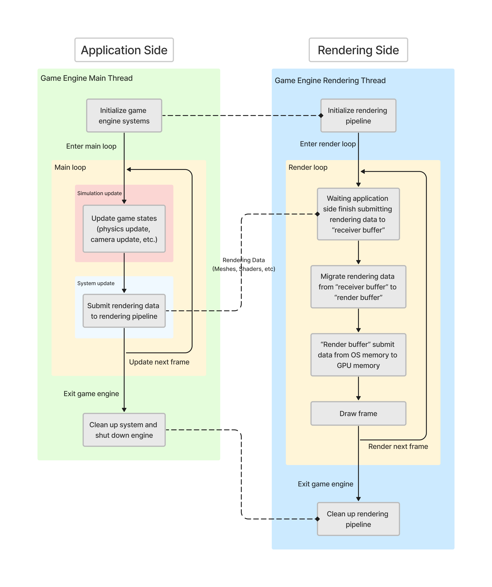

# 3D Game Engine

## Introduction

A lightweight game engine that is developed by C/C++ and targeted on the Windows operating system. The systems and components of this game engine include:

- **Cross-platform rendering pipeline**
- **Art asset pipeline**
- **Job system**
- **Maya plugin**
- **Utility components**
- **Math library**

Read this in other languages:
[简体中文](README.zh-CN.md)


<br></br>

## Catalog

+ [Graphics Library](#GraphicsLibrary)
+ [Rendering Pipeline](#RenderingPipeline)
+ [Asset Pipeline](#AssetPipeline)
+ [Job System](#JobSystem)
+ [Maya Plugin](#MayaPlugin)
+ [Utility](#Utility)
    - [Singleton](#Singleton)
    - [Smart Pointers](#SmartPointers)
+ [Math](#Math)
    - [Mathf](#Mathf)
    - [Vector](#Vector)
    - [Matrix](#Matrix)
+ [Future Plan](#FuturePlan)


- Designed to seamlessly run on both the x64 and Win32 platforms. Developed using Direct3D for x64 platfrom and OpenGL for Win32 platform.
- Comprehensive support for both GLSL and HLSL.
- Developed platform-specific rendering components such as "mesh" and "effect" representations. Developed platform-independent interfaces for inter-system interactions.


<br></br>
<a id="GraphicsLibrary"></a>

# 3D Graphics Library

游戏引擎的渲染管线要若要进行渲染，一个3D图形渲染库是不可缺少的。为此，该游戏引擎实现了一个简易的跨平台的3D图形渲染库。该图形渲染库具备以下特点和功能：

+ 跨平台性：该图像渲染库同时支持 x64 和 Win32 平台。在 x64 平台下该图形渲染库使用了 Direct3D 11 作为渲染后端，而在 Win32 平台下该图形渲染库使用了 OpenGL 4.6 作为渲染后端。由于在不同的平台下使用了不同的渲染后端和渲染逻辑，为此渲染库对自身的底层逻辑进行了封装，并设计了通用（universal/uniform）且平台独立（platform-independent）的接口以供外部系统的调用。该渲染库最终是静态库（Static Library）的形式部署在游戏引擎中，

+ Vertex Transform: Achieved translation, rotation, and scale by leveraging homogeneous coordinate; supported transformation between different spaces (i.e., Model Space, World Space, Image (Camera) Space, Perspective (NDC) Space, Screen Space).

+ Lighting: 基于 Lambert 光照模型实现了 Diffuse Lighting, Specular Lighting, Ambient Lighting.

+ Shading（Work in progress）: Implemented Phong shading, Gouraud shading, and Flat shading;

+ Texture（Work in progress）: Provided functionalities on applying image texture or procedure texture; performed perspective correction in affine space to correct distortion.


 
<br></br>
<a id="RenderingPipeline"></a>

# Rendering Pipeline

The game engine features a cross-platform rendering pipeline. This renderding pipeline is designed to support both **x64** and **Win32** platforms. For the x64 platform, the rendering backend utilizes **Direct3D 12**, while for the Win32 platform, **OpenGL 4.6** is employed. Owing to the usage of distinct rendering backends and logic across different platforms, the rendering pipeline encapsulates its underlying logic and offers universal, platform-independent interfaces for external access. 

For a comprehensive understanding, the architecture diagram of the rendering pipeline is attached below:



+ From the perspective of the rendering pipeline, the game engine can be bifurcated into two segments: the *"Application Side"* and the *"Rendering Side"*. Conceptually, application side and rendering side is desinged using **Producer-Comsuer design pattern**, where application side acts as the producer who calculates and "produces" rendering data while the rendering side functions as the consumer who utilizes this data to render the game visuals.

+ Both application side and rendering side operate on individual threads. The application side runs on the *"Game Engine Main Thread"*, which is responsible for game logic execution and all other engine functionalities except rendering. Conversely, the rendering side operates on the *"Game Engine Rendering Thread"*, dedicated to all rendering-related tasks.

+ Upon game engine initialization, the main thread initializes all engine systems, inclusive of the rendering pipeline. Furthermore, it is the responsibility of the main thread to create a new thread for the "Game Engine Rendering Thread".

+ Following initialization, the main thread enters the engine's main loop. This loop is dedicated to the execution of overall engine functionalities and gameplay logics. Updates within this loop can be further categorized into *"System Update"* and *"Simulation Update"*.
    - Simulation update is responsible for frame-by-frame gameplay updates, such as physics update, camera updates and such. Simulation update is synchronized with the game's frame rate.
    - System update, on the other hand, execute functionalities of game engine systems, like listerning user input and submitting rendering data to the rendering side. The iteration frequency of system update is tied to the CPU clock cycle.
    - The divergent iteration rates between system and simulation updates can induce certain rendering complications. 
    
        For instance, when rendering a moving mesh, the mesh's transform is updated within the simulation update, which updates on every frame (typically most games use a frame rate of 30FPS or 60FPS). However, in every CPU clock cycle, the system update submits the mesh's transform matrix to the rendering side. Should the system update directly submit the transform matrix (calculated in the simulation update) to the rendering side, the mesh movement would appear "jerky". 
        
        A mitigation strategy for such issues is calculating predictive rendering data based on system time and submitting those predictive data instead of raw data to the rendering side.
    - In current implementation, rendering data that needs to be submitted to rendering side comprises system time, camera information, meshes, shaders, and transform matrices of each game object, and such. 

+ After submitting rendering data to the rendering side, the subsequent rendering process is managed by the rendering side. Similar to the application side, once the rendering side completes its initialization, it enters a rendering loop. This loop is responsible for the visualization rendering during the game's runtime. As mentioned, application side and rendering side act as "producer" and "comsumer", while the game engine utilizes two distinct threads to run application side and rendering side. The rendering side employs a blocking wait mechanism during each rendering cycle, awaiting the application side to finalize the submission of rendering data before commencing the rendering.
    - However, utilizing a blocking synchronization is not optimal due to its potential to significantly degrade the engine's performance. Its advantages lie in its simplicity of implementation, ensuring thread safety and ease of maintenance. Considering the architecture of the game engine is relative simple, this design was chosen for thread synchronization.

+ The rendering side maintains two buffers for rendering data storage: *"Receiver Buffer"* and *"Render Buffer"*. The receiver buffer is tasked with receiving rendering data submitted by the application side, while the render buffer submits the rendering data from operating system's memory to GPU's memory for rendering. During one rendering cycle, the rendering data, initially calculated at the application side, is submitted to the receiver buffer. Upon completion of data submission, the rendering data is migrated from the receiver buffer to the render buffer. After finishing data migration, as the receiver buffer continues to accept rendering data for the next rendering cycle from application side, the render buffer submits its data to the GPU to perform rendering for this rendering cycle.
    - Considering the current rendering pipeline utilizes the blocking wait approach to obtain data, a single buffer would suffice for receiving from application side and subsequently submitting data to the GPU. The decision to implement a double-buffering design was made in anticipation of future updates, where the rendering pipeline might transition from a single-threaded to a multi-threaded approach. With multiple threads, data being submitted to the GPU could be overwritten by incoming data, necessitating the need for double or even multiple buffering.

+ Following the data submission by the render buffer, the rendering pipeline invokes the graphics library's draw call for frame's rendering.


+ ## Rendering Components

    To bolster the functioning of the rendering pipeline, the game engine implements the representations of rendering data, such as mesh, effect, and constant buffer. With the rendering pipeline being cross-platform, these components also employs a cross-platform implementation, encapsulating platform-specific underlying logics and presenting a platform-independent interface for invocations.

    Furthermore, as aforementioned, the engine's rendering pipeline adheres to a "producer-consumer" design, involving extensive data migrations. To better manage the creation, duplication, migration, and clean up of rendering data, rendering data representations are implemented using **Observer design pattern**. 


<br></br>
<br></br>
<a id="AssetPipeline"></a>

# Asset Pipeline

A game engine can be understood as a library responsible for providing specific functionalities essential for the development and execution of games. Consequently, game assets, such as game objects, meshes, shaders, and user data, are treated as external data by the game engine. The game engine acts as the "consumer" of these data. As such, these data should not be hard-coded into the game engine's source code. Instead, they should be stored on the disk and loaded into the game during runtime. The primary role of the asset pipeline is to oversee and manage the entire process, from the creation of game assets, their retrieval from storage, and finally, their loading into the game.

Like the rendering pipeline, the asset pipeline constitutes a complex system. What distinguishes the asset pipeline is its functionalities do not directly operate within the game. Additionally, certain game assets originate from external software. For instance, models are produced using 3D modeling software such as **Maya**. Consequently, the asset pipeline incorporates plugins for these external software to manage such assets. 

To provide a comprehensive understanding, the following section elaborates on the management of model data as an example, showcasing the architecture and flow of the asset pipeline.


+ The game engine presently utilizes models produced by Maya. Since Maya is an external third-party software from the perspective of the game engine, the asset pipeline requires plugins to extract model data from Maya. Autodesk, the parent company of Maya, offers SDKs and APIs like the **Maya Devkit** and **OpenMaya** for developers to extend its functionalities. The current game engine employs these SDKs to create a plugin that extracts model data from Maya. During build-time, the game engine compiles this plugin, which is then loaded by users into Maya.

+ Once the game artists and technical artists finalize the model creation and modification, users can employ the plugin to export the model data. The current implementation facilitates the extraction of model attributes such as vertex positions, normals, tangents, vertex colors, and vertex index winding orders from Maya. Eventually, the plugin exports the Maya model into a .lua format file.
    - Why is the model exported as a .lua file?  While .lua, being a human-readable file format, has limitations in terms of serialization/deserialization efficiency and security, it offers developers with data clarity and ease of data maintenance and debugging.

        Take model assets as an example. During game development, various roles, including game artists, technical artists, and game engineers, will collaborate on model development. At this stage, data readability, maintainability, and debuggability are paramount, making human-readable formats ideal. Once the development phase concludes and data is finalized, the emphasis shifts to data process efficiency, security, and ease of preservation. At this stage, using binary file formats for data is optimal.

+ After exporting Maya model, the model file resides either on the computer's disk or within a source control system. During build-time, *“MeshBuilder”*, a game engine's module that is specialized designed for processing model files, will load the .lua model files from disk and preprocess model data.
    - For instance, the default vertex index winding order for Maya models follows the right-handed rule. Since the game engine's rendering pipeline supports Direct3D in x64 platform and OpenGL in Win32 platform, and Direct3D uses left-handed winding order. The MeshBuilder adjusts the winding order to left-handed for outputs directed to the x64 platform during the preprocessing phase.

+ Post preprocessing phase, MeshBuilder compiles the model data into binary and exports it as a .mesh format file.
    - Note: .mesh is a custom file extension. Using .mesh for model files aids users in managing multiple game asset files. However, users can customize the extension based on their requirements.

+ During run-time, the game retrieves the binary model file exported by MeshBuilder, deserializes the model data, and subsequently creates mesh instances using those data. (For more details about the rendering component "mesh", please refer to the [Rendering Pipeline](#RenderingPipeline) section)


<br></br>
<br></br>
<a id="FuturePlan"></a>

# Future Plan

+ ## Rendering Pipeline

    1. **Multi-threading Optimization:** there is a plan to explore advanced thread synchronization methods to streamline the rendering process and ensure better synchronization between threads.

    2. **Extending Platform and Backend Support:** there is an intention to broaden the platform support, including Linux, MacOS, and mobile platforms. Additionally, expanding graphic API support is under consideration, with APIs such as Vulkan and Metal being potential candidates.

    3. **Post-processing Effects:** there is a plan to integrate various of post-processing effects to elevate the visual aesthetics. Potential inclusions encompass tone mapping, blurring, and Screen Space Ambient Occlusion (SSAO), among others.

    4. **Physically Based Rendering (PBR):** there is an intention to integrate rendering techniques related to physics. Techniques such as real-time shadows, global illumination, and Physically Based Rendering (PBR) are subjects of interest for future development.

+ ## Asset Pipeline
    1. **Automation:** Presently, many processes within the asset pipeline are contingent on manual interventions by users. For instance, the installation of plugins, such as the one used for Maya, requires user-initiated actions. To improve this, there's a plan to infuse greater automation into the pipeline's operations.

        ```
        **自动化：** 当前的资产管线的许多过程中仍依赖于用户的手动操作，有计划在未来的开发中使资产管线的运作更加自动化。例如资产管线可以自动安装Maya插件。
        ```

    2. **Asset Editor:** As of now, any edits to the asset files necessitate users to manipulate the source code directly. This can be cumbersome and prone to errors, especially for those not well-acquainted with code-based manipulations. Future development blueprint encompasses the creation of a asset editor that offers graphical user interface (GUI). 

        ```
        2. **可视化资产编辑器：** 在当前的实现下，用户若需要编辑资产文件，只能通过代码编辑对资产文件的源码进行编辑。有计划在未来开发可视化的资产编辑器，使用户可以更加方便地编辑资产文件。
        ```

    3. **Enhanced Error Detection:** The existing error detection within the asset pipeline, particularly during data deserialization and conversion, is somewhat rudimentary. While it addresses basic error scenarios, there's room for improvement in terms of comprehensiveness. The future development intends to introduce a more robust and comprehensive error detection mechanism.
    
        ```
        3. **错误检测机制：** 当前资产管线对数据的读取和转换采用了较为单一的错误检测机制。有计划在未来为资产管线加入更加全面的错误检测机制。
        ```


```
TODO: 
1. 需要更详细得解释 system update 和 simulation update 的区别，simulation 和 non-simulation 的逻辑。
2. 需要解释为何渲染管线不属于simulation的一部分（大智对游戏引擎不熟悉），mian thread 和 rendering thead 是生产者和消费者的关系吗？会有asynchronize的问题吗？
3. 讲得太底层（比如说下面说到 “主线程就是一个while(true)循环”），给人的感觉这个README像是写给自己的看的，而不是放在简历上用来对外展示自己skillset的，面向对象是自己，而不是面试官。容易让人underestimate我的工作。
4. 可以考虑放 rendering pipeline 的架构图和流程图。
5. 展示我用到的skill set，以及我的工作的能做什么，做到了什么程度，我这个项目的架构是怎么设计的。考虑到可能有的人会想clone下来跑，最好加上 how to run 的教程
```

<br></br>

# Rendering Pipeline

- 为了更好的介绍渲染管线，需要先介绍游戏引擎的运行架构。游戏引擎分为两个线程
    1. 主线程 （mian thread）
    2. 渲染线程 （rendering thread）


- 主线程本质上就是一个 `while(true)` 循环。主线程中的循环负责两种更新（update）：
    1. system update: 该update就是 `while(true)` 循环本身，负责执行一些引擎系统的底层逻辑（non-simulation），速率与 `while（true）`循环的速率一致，也就是 cpu tick 频率。

    2. simulation update：该 update 也在 system update 所处的 `while(true)` 循环中执行，但执行速率受用户设置的 simulation rate 限制。simulation update 用于模拟游戏引擎的帧率更新，游戏引擎的所有游戏逻辑都应该在 simulation update 中运行。

- 渲染线程本质上也是一个 `while(true)` 循环。渲染线程只负责向 GPU 提交渲染数据 （例如 vertex，index，shader等）然后调用渲染库接口 （Direct3D 和 OpenGL）进行绘制。


- 渲染管线的流程如下：
    1. 引擎的主线程进行初始化，包括对引擎的各个系统进行初始化，对渲染线程进行初始化，以及对游戏的各项资源（例如camera，各个gameobject，gameobject各自的 mesh，effect，rigid body等数据）进行初始化。

    2. 主线程会负责在 simulation update 中，也就是每一帧中，更新游戏中的各项数据，比如更新 gameobject 的位置，速度等数据。
        - 注：由于数据更新是每一帧更新一次，对于渲染来说，直接使用gameobject的顶点位置来渲染会导致gameobject在游戏画面中的移动会一卡一卡的。因此 simulation update 的职责是只负责更新数据本身。但渲染的时候不能直接使用 simulation update 的数据进行渲染。

    3. 此外主线程会负责在 system update 中，也就是每一个 CPU tick 中，向渲染线程同时也是向渲染库提交需要渲染的数据。在此之后，渲染流程就全权交由渲染线程处理。

    4. 到了渲染库这一步处理后，渲染库维持着两个buffer，一个buffer叫 `s_dataBeingSubmittedByApplicationThread`，他负责接收从主线程提交的渲染数据，另一个buffer叫 `s_dataBeingRenderedByRenderThread`，渲染库将会把这个buffer中数据提交给GPU进行渲染。

    5. 在渲染线程中，在每一个循环中，渲染线程会阻塞地等待着下一帧需要渲染的数据从主线程提交到 `s_dataBeingSubmittedByApplicationThread` buffer中。当提交完成后，渲染线程会把渲染数据从 `s_dataBeingSubmittedByApplicationThread` buffer 拷贝到 `s_dataBeingRenderedByRenderThread` buffer。然后调用渲染库API把数据从 `s_dataBeingRenderedByRenderThread` buffer 提交到GPU，并通知GPU渲染下一帧的画面。

    
<br></br>

# Data/File Pipeline

对于游戏引擎来说，gameobject的transform，mesh，shader，effect等都属于用户自定义数据（这里的用户指的是gameplay programmer 和 graphic programmer而不是游戏玩家）。因此这些数据不应该以硬编码的形式写在游戏引擎的代码中，而是应该是存放在电脑磁盘上，在游戏运行时再从磁盘上读取加载到游戏中。

数据管线的任务是负责管理这些数据从源头，到载入到游戏的整个流程。当前项目只实现了针对渲染资产（rendering asset，即mesh和shader）的数据管线，针对gameobject的数据管线将在后期开发中实现。
当前引擎的数据管线能够从3D建模软件Maya中导出模型的网格数据，并以Lua文件的形式保存在电脑的磁盘上，在编译构建游戏的时候，数据管线会读取之前提取好的Lua模型文件，并在构建时（build-time）把Lua格式的模型文件编译成二进制文件，与其他游戏数据文件存放在一起。最后在游戏运行时（run-time）由游戏程序直接对二进制模型文件进行读取与加载。

- 数据管线的流程：
    1. 渲染资产的源头（source）是建模软件Maya。Maya对于我的游戏引擎来说属于第三方软件，因此游戏引擎根据Maya提供的API和SDK实现了一个Maya插件，用以从Maya中导出模型数据。在目前的实现中，插件会从Maya中导出模型的顶点位置，法向量（normal），切线值（tangent），顶点颜色，以及顶点三角形的构成顺序（winding order）。并导出成Lua文件。
        - 注：为何要导出为Lua文件？在插件端直接就导出成二进制文件固然是可以的，但对于用户来说，也就是这个引擎的使用者来说，他们仍然需要对导出的数据文件进行二次开发工作。一个在游戏开发中比较常见的场景是：3D建模师完成建模任务后会使用插件对模型进行导出，然后技术美术和游戏开发工程师会对模型进行各项后期处理（比如骨绑 rigging）。在这个阶段中，数据文件仍未完成其所有的开发流程，数据在这个阶段需要强调其可读性和可纠错性，因此数据需要以人类可读的格式（human-readable format）保存，例如Lua或JSON。在数据走完所有开发流程，已经定型后，这个时候强调的则是数据的易处理性，易保存性以及安全性，这个时候才应该把数据编译成二进制文件。
    
    2. 在引擎对游戏进行构建时（build-time）。引擎的 `MeshBuilder` 会读取已经导出的Lua格式的模型的，并把模型数据编译成二进制文件（为了方便与Lua格式的模型文件区分开来，二进制格式的模型文件的拓展名被定义为.mesh，但具体是可以由用户决定的）。在构建这一步中，`MeshBuilder` 也会根据不同的平台对模型数据进行相应的修饰，例如Maya的三角形渲染顺序采用的是右手系，在针对Direct3D进行构建的时候，`MeshBuilder` 会先把顶点索引信息（index winding order）调整为左手系顺序，再编译成二进制文件。

    3. 在游戏运行时（run-time），在主线程对游戏中的各个资源进行加载和初始化时，二进制格式的模型数据会被解析，并用以初始化其对应的 gameobject 。