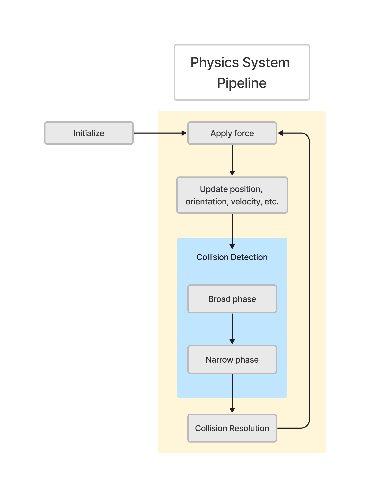

# Lightweight Game Engine

## Introduction

A lightweight game engine that is developed by C/C++. The systems and components of this game engine include:

- **Rendering pipeline**
- **Physics System**
- **Asset pipeline**
- **Job system**
- **Audio System**
- **Utility components (singleton, smart pointer, etc.)**
- **Math library**

For more detail of the above components, please refer to the [game engine tech-doc](TechDoc.md).

Read this in other languages:
[简体中文](README.zh-CN.md)

 

## Demos

| **Mini Game Demo - Raiden II** |
|           :---              |
| The video below shows a vertical scroll shooter game developed using this game engine. The gameplay is inspired by *"Raiden II"*. The player is represented by the colorful block in the video, and they need to avoid falling rocks, aliens, and enemy bullets.   The development of this mini-game utilized various engine features such as the rendering pipeline, the physics system, and the audio system. The build of this mini-game can be dowloaded [here](Documents/Builds/ScrollShooterDemo) |
|  |

| **Rendering Pipeline Demo** |
|           :---              |
| The GIF below demostrates the functionality of the renderind pipeline, such as mesh rendering, mesh transforms, vertex color, animate shaders.   The two white-box character models are exported using the *"Maya Exporter"* plugin provided by this game engine (See [Asset Pipeline](#AssetPipeline) session for more detail).   The development of lighting, shardowing and texturing is in progress. |
|  |

| **Physics System Demo - BVH Tree** |
|               :---                 | 
| The GIF below demonstrates the usage of the BVH (Bounding Volume Hierarchy) tree for managing colliders in the game world, and illustrates how the BVH tree updates.   In the visualization, the BVH tree is represented by blue frames, while the colliders are represented by frames in various colors.  |
|   |

| **Physics System Demo - Collision Detection and Resolution** |
|                           :---                               | 
| The GIF below illustrates the collision detection and collision resolution processes within the games runtime.   In the visualization, cube frames represent AABB (Axis-Aligned Bounding Box) colliders and diamon frames represent sphere colliders.   The color code is as follows: green denotes normal colliders, yellow denotes static colliders, pink denotes trigger colliders and red indicates that collider is colliding with other colliders.   Note that both static colliders and trigger colliders are not involved in collision resolution.  |
|   |

| **Game Engine System Release** |
|               :---                  | 
|  The build of this game engine can be downloaded [here](Documents/Builds/EngineDemo). The file named *"MyGame.exe"* is the executable for the game engine. |
|  To run the engine, use the following controls:   For controlling one of the AABB colliders: "A," "W," "S," "D," "R," "F".   For camera control: "Left Arrow," "Right Arrow," "Up Arrow," "Down Arrow," "Delete," "Home," "End," "Page Down"  |

  

## Catalog

+ [Rendering Pipeline](#RenderingPipeline)

+ [Physics System](#PhysicsSystem)

+ [Asset Pipeline](#AssetPipeline)

+ [Job System](#JobSystem)

+ [Utility](#Utility)
    - [Singleton](#Singleton)
    - [Smart Pointers](#SmartPointers)

+ [Math](#Math)
    - [Mathf](#Mathf)
    - [Vector](#Vector)
    - [Matrix](#Matrix)
    
+ [Work In Progress](#WorkInProgress)

+ [Future Plan](#FuturePlan)

  

# Rendering Pipeline

The game engine features a cross-platform rendering pipeline. This renderding pipeline is designed to support both **x64** and **Win32** platforms. For the x64 platform, the rendering backend utilizes **Direct3D 12**, while for the Win32 platform, **OpenGL 4.6** is employed. Owing to the usage of distinct rendering backends and logic across different platforms, the rendering pipeline encapsulates its underlying logic and offers universal, platform-independent interfaces for external access. 

For more detail of the rendering pipeline, please refer to the [Rednering Pipeline](./TechDoc.md#RenderingPipeline) section in the tech-doc.

## Architecture

For a comprehensive understanding, the architecture diagram of the rendering pipeline is attached below:

## Rendering Components

To bolster the functioning of the rendering pipeline, the game engine implements the representations of rendering data, such as mesh, effect, and constant buffer. With the rendering pipeline being cross-platform, these components also employs a cross-platform implementation, encapsulating platform-specific underlying logics and presenting a platform-independent interface for invocations.

Furthermore, as aforementioned, the engine's rendering pipeline adheres to a "producer-consumer" design, involving extensive data migrations. To better manage the creation, duplication, migration, and clean up of rendering data, rendering data representations are implemented using **Observer design pattern**. 

  
  

# Physics System

The physics system encompasses various components, including the implementation of physics objects, simulation of rigid body dynamics, and mechanisms for collision detection and resolution.

Regarding physics objects, the system implements the representations for **transform**, **rigid bodie**, and **collider**.

For collision detection, the physics system utilizes both **broad phase** collision detection and **narrow phase** collision detection techniques. During the broad phase of collision detection, the system employs the **Sweep And Prune** algorithm in conjunction with **Bounding Volume Hierarchies (BVH)** algorithm. Users can choose between these algorithms based on their specific runtime requirements and complexity.

For collision resolution, the physics system employs a constraint-based resolution mechanism. Additionally, the physics system provides tailored collision resolution strategies for dynamic colliders, static colliders, and trigger colliders, addressing the varying requirements and interactions between these object types.

For more detail of the physics system, please refer to the [Physics System](./TechDoc.md#PhysicsSystem) section in the tech-doc.

## Architecture

For a comprehensive understanding, the workflow diagram of the physics system is attached below:

  
  

# Asset Pipeline

A game engine can be understood as a library responsible for providing specific functionalities essential for the development and execution of games. Consequently, game assets, such as game objects, meshes, shaders, and user data, are treated as external data by the game engine. The game engine acts as the "consumer" of these data. As such, these data should not be hard-coded into the game engine's source code. Instead, they should be stored on the disk and loaded into the game during runtime. The primary role of the asset pipeline is to oversee and manage the entire process, from the creation of game assets, their retrieval from storage, and finally, their loading into the game.

Like the rendering pipeline, the asset pipeline constitutes a complex system. What distinguishes the asset pipeline is its functionalities do not directly operate within the game. Additionally, certain game assets originate from external software. For instance, models are produced using 3D modeling software such as **Maya**. Consequently, the asset pipeline incorporates plugins for these external software to manage such assets. 

For more detail of the asset pipeline, please refer to the [Asset Pipeline](./TechDoc.md#AssetPipeline) section in the tech-doc.

## Architecture

To provide a comprehensive understanding, the following section elaborates on the management of model data as an example, showcasing the architecture and flow of the asset pipeline.

  
  

# Job System

Job system is desinged for tasks execution and management using multi-threads techniques.

The job system provides a range of APIs for users to manage tasks and the job system itself. Users can create job queues and assign job runners to improve game engine performance based on the run-time demand. Additionally, users can remove redundant job queues and idle job runners based on the workload of the job system, so as to optimize resource utilization.

Furthermore, the job system implements an automatic workload adjustment mechanism. When creating a new job queue, users can choose to apply this mechanism or not. This mechanism dynamically creates or removes job runners based on the number of pending jobs in each job queue it manages. This ensures an optimized balance between resource utilization and task execution efficiency.

For more detail of the job system, please refer to the [Job System](./TechDoc.md#JobSystem) section in the tech-doc.

## Architecture

To provide a clearer understanding of the job system's architecture, the following is a concise blueprint outlining its key components and their interactions.

## Automatic Workload Adjustment 

The number of jobs that a job queue needs to execute may vary over time. On one hand, if there are too many jobs waiting to be executed and insufficient job runners available, it can lead to a slowdown in program performance. On the other hand, if the number of job runners significantly exceeds the actual demand, those idle job runners will waste system resources. It is important to strike a balance between the demand and supply of job runners to optimize program performance and resource utilization.

The current automatic workload adjustment mechanism provides a simple approach to address the aforementioned problem. Each job queue is equipped with a `WorkloadManager` object for the workload adjustment. The `WorkloadManager` keeps track of the workload status of the associated job queue. Two flags, *"isTooMany"* and *"isTooFew"*, are used by the `WorkloadManager` to indicate the workload status: whether there are too many or too few jobs in the queue. These flags are triggered based on a comparison between the number of waiting jobs and the corresponding threshold values. The default job queue in the job system maintains a routine to continuously check the status of these flags for each WorkloadManager and dynamically adjusts the number of job runners accordingly, adding or removing them as needed.

  
  

# Utility

## Singleton.h

This file implements `Singleton` class that serves as a base class designed to convert any derived class into a singleton. The `Singleton` class is implemented as a template class to ensure its wide applicability and versatility.

Ensuring that only one instance exists in the entire application is a key requirement for a class that is also a singleton. To achieve this, the constructor of the `Singleton` class is set to private, priventing users from directly instantiating a class instance. Additionally, certain class members such as the copy constructor and assignment operator are explicitly deleted to prevent implicit instantiation of the class. It is important to enforce these rules consistently in all classes derived from the `Singleton` base class, to maintain the rule of "one instance globally".

For more detail of the singleton, please refer to the [Singleton](./TechDoc.md#Singleton) section in the tech-doc.

 

## SmartPointers

This file implements smart pointers that are commonly used in dynamic memory resource management, and their necessary components. These components include `RefCount`, `PtrBase`, `SmartPtr`, and `WeakPtr`.

+ [RefCount](#refcount)
+ [PtrBase](#ptrbase)
+ [SmartPtr](#smartptr)
+ [WeakPtr](#weakptr)

For more detail of smart pointers, please refer to the [SmartPointers](./TechDoc.md#SmartPointers) section in the tech-doc.

+ ## RefCount

    `RefCount` serves as a control component of both `SmartPtr` and `WeakPtr`. In runtime, `RefCount` is a dynamically-allocated object that holds:
    - A pointer to the managed object;
    - A user-defined deleter;
    - The number of `SmartPtr` that own the managed object;
    - the number of `WeakPtr` that refer to the managed object.

    As a control component, `RefCount` owns the direct authority of deleting the pointer to the managed object, releasing itself, and increasing or decreasing the reference count of both `SmartPtr` and `WeakPtr`. On the other hand, `PtrBase`, `SmartPtr` and `WeakPtr` rely on the provided APIs of `RefCount` to manage this data. They are not able to directly manipulate the data themselves.

+ ## PtrBase

    `PtrBase` is the base class for both `SmartPtr` and `WeakPtr`. It serves as a API contract for `SmartPtr` and `WeakPtr`, defining certain rules for their member function implementations. Therefore, `PtrBase` cannot be instantiated through copy constructor or assignment operations, and its data is set to be "protected". In general, `PtrBase` specifies the implementation rules for constructors, reference increment/decrement, and data operating functions.

    In the typical implementation, `PtrBase` holds two pointers: one points to the managed object, and the other points to the control block (See "[*RefCount*](#refcount)" section for more details).

+ ## SmartPtr

    `SmartPtr` retains shared ownership of an object through a pointer. Several `SmartPtr` objects may own the same object. The managed object is destroyed and its memory deallocated when either of the following happens:

    - The last remaining `SmartPtr` owning the object is destroyed;
    - The last remaining `SmartPtr` owning the object is assigned another pointer via `operator=` or `Reset()`.
    
    The managed object is destroyed is destroyed using delete-expression or a custom deleter that is supplied to `SmartPtr` during construction. It's important to note that `SmartPtr` does not support delete-expression for array-type objects (i.e. `delete []`) by default, it is user's responsibility to provide apporpriate deleter during construction.

    A `SmartPtr` can share ownership of an object while storing a pointer to another object. This feature allows for pointing to member objects while owning the object they belong to. The stored pointer is the one accessed by `Get()`, the dereference and the comparison operators. On the other hand, the managed pointer is the one to be destroyed when reference count reaches 0.

    A `SmartPtr` may also own no objects, in which case it is called "empty" (An empty `SmartPtr` may have a non-null stored pointer if the aliasing constructor was used to create it).

+ ## WeakPtr

    `WeakPtr` is a smart pointer that holds a non-owning ("weak") reference to an object that is managed by `SmartPtr`. A `WeakPtr` must be converted to `SmartPtr` in order to access the referenced object.

    `WeakPtr` models temporary ownership: when an object needs to be accessed only if it exists, and it may be deleted at any time by someone else, `WeakPtr` is used to track the object, and it is converted to `SmartPtr` to assume temporary ownership. If the original `SmartPtr` is destroyed at this time, the object's lifetime is extended until the temporary `SmartPtr` is destroyed as well.

    Another use for `WeakPtr` is to break reference cycles formed by objects managed by `SmartPtr`. If such cycle is orphaned (i.e., there are no outside shared pointers into the cycle), the `SmartPtr` reference counts cannot reach zero and the memory is leaked. To prevent this, one of the pointers in the cycle can be made weak.

    Like `SmartPtr`, a typical implementation of `WeakPtr` stores two pointers:
    + A pointer to the control block; 
    + The stored pointer of the `SmartPtr` it was constructed from.

    A separate stored pointer is necessary to ensure that converting a `SmartPtr` to `WeakPtr` and then back works correctly, even for aliased `SmartPtrs`. It is not possible to access the stored pointer in a `WeakPtr` without converting it into a `SmartPtr`.

  
  

# Math

## Mathf.h

This file implements various mathematical operations that are commonly used in calculations within the game engine. These operations are implemented as global APIs, allowing users to conveniently access them in the global scope. In current implementation, the operations primarily revolve around: value comparison, random value generation, and validation detection.

For more detail of Mathf.h library, please refer to the [Mathf.h](./TechDoc.md#Mathf) section in the tech-doc.

 

## Vector.h

This file contains the definitions and implementations of data structures known as "vector" which are commonly used in linear algebra calculations.

For more detail of vector class, please refer to the [Vector](./TechDoc.md#Vector) section in the tech-doc.

+ ### Features
    - A vector is implemented by a 1-dimensional array, which can be considered as a 1xN row vector or an Nx1 column vector. The current implementation supports three types of vector classes: `Vector2`, `Vector3`, and `Vector4`, representing vectors with size of 2, 3, and 4, respectively.
    - Each vector class is implemented as a template class that only accepts numerical types (e.g., `int`, `float`, `double`, `uint8`, `uint16`...) as template arguments.
    - Additionally, each vector class provides convenient shortcuts for special vector instances, such as the `Zero` vector (0,0,0), the `Up` vector (0,0,1), the `Down` vector (0,0,-1), and so on. These instances are implemented as static constant instances. Since the compiler cannot infer the type of a static instance at compile time, these instances need to be explicitly implemented in advance. The current implementation supports `int`, `short`, `long`, `float`, and `double` types for each static instance.

 

## Matrix.h

This file contains the definitions and implementations of data structures known as "matrix" which are commonly used in linear algebra calculations and 3D mathematical calculations.

For more detail of matrix class, please refer to the [Matrix](./TechDoc.md#Matrix) section in the tech-doc.

+ ### Features
    - The matrix class is implemented using a N-by-N 2-dimensional array. Considering that most 3D mathematical calculations involve square matrices, the matrix class only supports square matrices to simplify program structure. The current implementation includes two types of matrix classes: `Matrix3` and `Matrix4`, representing matrix with size of 3x3 and 4x4, respectively.
    - Each matrix class is implemented as a template class that only accepts numerical types (e.g., `int`, `float`, `double`, `uint8`, `uint16`...) as template arguments.
    - Additionally, each matrix class provides convenient shortcuts to generate commonly used matrix instances in mathematical calculations, such as identity matrix, rotation matrix, translation matrix, and so on. These shortcuts are implemented as static functions.

  
  

# Work In Progress

+ ## Light Rendering

+ ## Texturing

  
  

# Future Plan

+ ## Rendering Pipeline

    1. **Multi-threading Optimization:** there is a plan to explore advanced thread synchronization methods to streamline the rendering process and ensure better synchronization between threads.

    2. **Extending Platform and Backend Support:** there is an intention to broaden the platform support, including Linux, MacOS, and mobile platforms. Additionally, expanding graphic API support is under consideration, with APIs such as Vulkan and Metal being potential candidates.

    3. **Post-processing Effects:** there is a plan to integrate various of post-processing effects to elevate the visual aesthetics. Potential inclusions encompass tone mapping, blurring, and Screen Space Ambient Occlusion (SSAO), among others.

    4. **Physically Based Rendering (PBR):** there is an intention to integrate rendering techniques related to physics. Techniques such as real-time shadows, global illumination, and Physically Based Rendering (PBR) are subjects of interest for future development.

+ ## Asset Pipeline

    1. **Automation:** Presently, many processes within the asset pipeline are contingent on manual interventions by users. For instance, the installation of plugins, such as the one used for Maya, requires user-initiated actions. To improve this, there's a plan to infuse greater automation into the pipeline's operations.

    2. **Asset Editor:** As of now, any edits to the asset files necessitate users to manipulate the source code directly. This can be cumbersome and prone to errors, especially for those not well-acquainted with code-based manipulations. Future development blueprint encompasses the creation of a asset editor that offers graphical user interface (GUI). 

    3. **Enhanced Error Detection:** The existing error detection within the asset pipeline, particularly during data deserialization and conversion, is somewhat rudimentary. While it addresses basic error scenarios, there's room for improvement in terms of comprehensiveness. The future development intends to introduce a more robust and comprehensive error detection mechanism.

