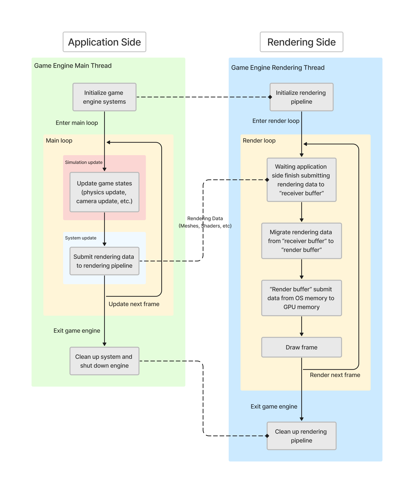
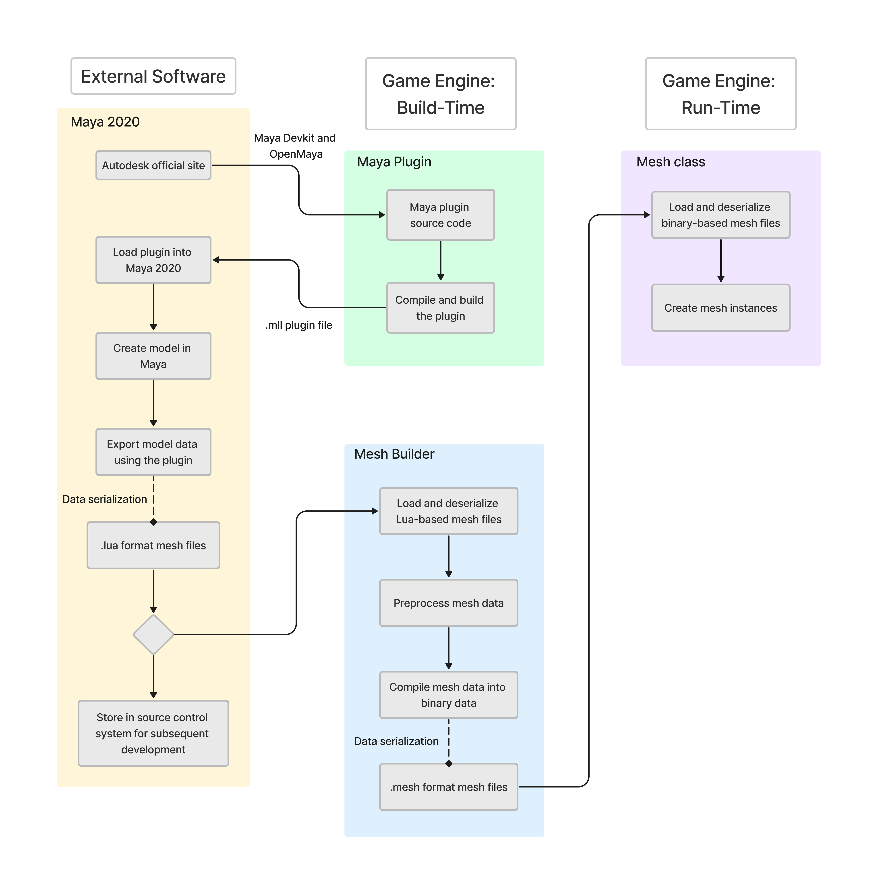
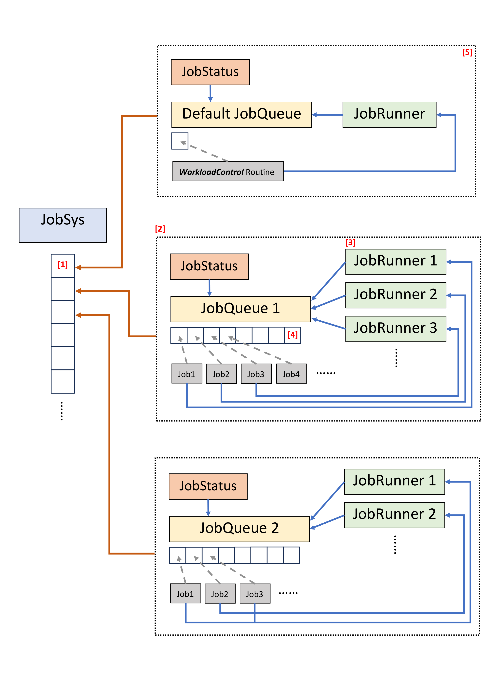

# Lightweight Game Engine - Tech Doc


## Catalog

+ [Rendering Pipeline](#RenderingPipeline)

+ [Physics System](#PhysicsSystem)

+ [Asset Pipeline](#AssetPipeline)

+ [Job System](#JobSystem)

+ [Utility](#Utility)
    - [Singleton](#Singleton)
    - [Smart Pointers](#SmartPointers)

+ [Math](#Math)
    - [Mathf](#Mathf)
    - [Vector](#Vector)
    - [Matrix](#Matrix)


<br></br>
<a id="RenderingPipeline"></a>

# Rendering Pipeline

The game engine features a cross-platform rendering pipeline. This renderding pipeline is designed to support both **x64** and **Win32** platforms. For the x64 platform, the rendering backend utilizes **Direct3D 12**, while for the Win32 platform, **OpenGL 4.6** is employed. Owing to the usage of distinct rendering backends and logic across different platforms, the rendering pipeline encapsulates its underlying logic and offers universal, platform-independent interfaces for external access. 


## Architecture

For a comprehensive understanding, the architecture diagram of the rendering pipeline is attached below:




+ From the perspective of the rendering pipeline, the game engine can be bifurcated into two segments: the *"Application Side"* and the *"Rendering Side"*. Conceptually, application side and rendering side is desinged using **Producer-Comsuer design pattern**, where application side acts as the producer who calculates and "produces" rendering data while the rendering side functions as the consumer who utilizes this data to render the game visuals.

+ Both application side and rendering side operate on individual threads. The application side runs on the *"Game Engine Main Thread"*, which is responsible for game logic execution and all other engine functionalities except rendering. Conversely, the rendering side operates on the *"Game Engine Rendering Thread"*, dedicated to all rendering-related tasks.

+ Upon game engine initialization, the main thread initializes all engine systems, inclusive of the rendering pipeline. Furthermore, it is the responsibility of the main thread to create a new thread for the "Game Engine Rendering Thread".

+ Following initialization, the main thread enters the engine's main loop. This loop is dedicated to the execution of overall engine functionalities and gameplay logics. Updates within this loop can be further categorized into *"System Update"* and *"Simulation Update"*.
    - Simulation update is responsible for frame-by-frame gameplay updates, such as physics update, camera updates and such. Simulation update is synchronized with the game's frame rate.
    - System update, on the other hand, execute functionalities of game engine systems, like listerning user input and submitting rendering data to the rendering side. The iteration frequency of system update is tied to the CPU clock cycle.
    - The divergent iteration rates between system and simulation updates can induce certain rendering complications. 
    
        For instance, when rendering a moving mesh, the mesh's transform is updated within the simulation update, which updates on every frame (typically most games use a frame rate of 30FPS or 60FPS). However, in every CPU clock cycle, the system update submits the mesh's transform matrix to the rendering side. Should the system update directly submit the transform matrix (calculated in the simulation update) to the rendering side, the mesh movement would appear "jerky". 
        
        A mitigation strategy for such issues is calculating predictive rendering data based on system time and submitting those predictive data instead of raw data to the rendering side.
    - In current implementation, rendering data that needs to be submitted to rendering side comprises system time, camera information, meshes, shaders, and transform matrices of each game object, and such. 

+ After submitting rendering data to the rendering side, the subsequent rendering process is managed by the rendering side. Similar to the application side, once the rendering side completes its initialization, it enters a rendering loop. This loop is responsible for the visualization rendering during the game's runtime. As mentioned, application side and rendering side act as "producer" and "comsumer", while the game engine utilizes two distinct threads to run application side and rendering side. The rendering side employs a blocking wait mechanism during each rendering cycle, awaiting the application side to finalize the submission of rendering data before commencing the rendering.
    - However, utilizing a blocking synchronization is not optimal due to its potential to significantly degrade the engine's performance. Its advantages lie in its simplicity of implementation, ensuring thread safety and ease of maintenance. Considering the architecture of the game engine is relative simple, this design was chosen for thread synchronization.

+ The rendering side maintains two buffers for rendering data storage: *"Receiver Buffer"* and *"Render Buffer"*. The receiver buffer is tasked with receiving rendering data submitted by the application side, while the render buffer submits the rendering data from operating system's memory to GPU's memory for rendering. During one rendering cycle, the rendering data, initially calculated at the application side, is submitted to the receiver buffer. Upon completion of data submission, the rendering data is migrated from the receiver buffer to the render buffer. After finishing data migration, as the receiver buffer continues to accept rendering data for the next rendering cycle from application side, the render buffer submits its data to the GPU to perform rendering for this rendering cycle.
    - Considering the current rendering pipeline utilizes the blocking wait approach to obtain data, a single buffer would suffice for receiving from application side and subsequently submitting data to the GPU. The decision to implement a double-buffering design was made in anticipation of future updates, where the rendering pipeline might transition from a single-threaded to a multi-threaded approach. With multiple threads, data being submitted to the GPU could be overwritten by incoming data, necessitating the need for double or even multiple buffering.

+ Following the data submission by the render buffer, the rendering pipeline invokes the graphics library's draw call for frame's rendering.


## Rendering Components

To bolster the functioning of the rendering pipeline, the game engine implements the representations of rendering data, such as mesh, effect, and constant buffer. With the rendering pipeline being cross-platform, these components also employs a cross-platform implementation, encapsulating platform-specific underlying logics and presenting a platform-independent interface for invocations.

Furthermore, as aforementioned, the engine's rendering pipeline adheres to a "producer-consumer" design, involving extensive data migrations. To better manage the creation, duplication, migration, and clean up of rendering data, rendering data representations are implemented using **Observer design pattern**. 


## APIs
```cpp

/* Initialize the rendering pipeline and graphics library */
cResult Initialize( const sInitializationParameters& );

/* Subtmit system tick and simulation tick for rendering */
void SubmitElapsedTime( float, float );

/* Submit the color data to clear the last frame (also set the background for this frame) */
void SubmitBackgroundColor( float, float, float, float = 1.0f );

/* Submit the transform matrix of camera of this frame */
void SubmitCameraMatrices( Math::cMatrix_transformation, Math::cMatrix_transformation );

/* Submit rendering data of this frame */
cResult SubmitNormalRenderData(ConstantBufferFormats::sNormalRender[], uint32_t );

/* Submit rendering data for debug of this frame */
cResult SubmitDebugRenderData(ConstantBufferFormats::sDebugRender[], uint32_t );

/* This is called (automatically) from the main/render thread. 
   It will render a submitted frame as soon as it is ready */
void RenderFrame();

```


<br></br>
<br></br>
<a id="PhysicsSystem"></a>

# Physics System

The physics system encompasses various components, including the implementation of physics objects, simulation of rigid body dynamics, and mechanisms for collision detection and resolution.

Regarding physics objects, the system implements the representations for **transform**, **rigid bodie**, and **collider**.

For collision detection, the physics system utilizes both **broad phase** collision detection and **narrow phase** collision detection techniques. During the broad phase of collision detection, the system employs the **Sweep And Prune** algorithm in conjunction with **Bounding Volume Hierarchies (BVH)** algorithm. Users can choose between these algorithms based on their specific runtime requirements and complexity.

For collision resolution, the physics system employs a constraint-based resolution mechanism. Additionally, the physics system provides tailored collision resolution strategies for dynamic colliders, static colliders, and trigger colliders, addressing the varying requirements and interactions between these object types.


## Architecture

For a comprehensive understanding, the workflow diagram of the physics system is attached below:


The detail descrition of the physics engine is still in progress


## APIs
```cpp

/* Initialize the physicis system */
void Initialize( const std::vector<cCollider*>&, uint8_t );

/* Detect if two collider overlap with each other */
bool IsOverlaps(cCollider* i_lhs, cCollider* i_rhs);

/* Update the collision detection status of the physics system */
void Update_CollisionDetection();

/* Update the collision resolution status of the physics system */
void Update_CollisionResolution();

/* Add a new collider to the physics system */
void RegisterCollider( cCollider* );

/* Remove a existing collider from the physics system */
cResult DeregisterCollider( cCollider* );

```


<br></br>
<br></br>
<a id="AssetPipeline"></a>

# Asset Pipeline

A game engine can be understood as a library responsible for providing specific functionalities essential for the development and execution of games. Consequently, game assets, such as game objects, meshes, shaders, and user data, are treated as external data by the game engine. The game engine acts as the "consumer" of these data. As such, these data should not be hard-coded into the game engine's source code. Instead, they should be stored on the disk and loaded into the game during runtime. The primary role of the asset pipeline is to oversee and manage the entire process, from the creation of game assets, their retrieval from storage, and finally, their loading into the game.

Like the rendering pipeline, the asset pipeline constitutes a complex system. What distinguishes the asset pipeline is its functionalities do not directly operate within the game. Additionally, certain game assets originate from external software. For instance, models are produced using 3D modeling software such as **Maya**. Consequently, the asset pipeline incorporates plugins for these external software to manage such assets. 


## Architecture

To provide a comprehensive understanding, the following section elaborates on the management of model data as an example, showcasing the architecture and flow of the asset pipeline.




+ The game engine presently utilizes models produced by Maya. Since Maya is an external third-party software from the perspective of the game engine, the asset pipeline requires plugins to extract model data from Maya. Autodesk, the parent company of Maya, offers SDKs and APIs like the **Maya Devkit** and **OpenMaya** for developers to extend its functionalities. The current game engine employs these SDKs to create a plugin that extracts model data from Maya. During build-time, the game engine compiles this plugin, which is then loaded by users into Maya.

+ Once the game artists and technical artists finalize the model creation and modification, users can employ the plugin to export the model data. The current implementation facilitates the extraction of model attributes such as vertex positions, normals, tangents, vertex colors, and vertex index winding orders from Maya. Eventually, the plugin exports the Maya model into a .lua format file.
    - Why is the model exported as a .lua file?  While .lua, being a human-readable file format, has limitations in terms of serialization/deserialization efficiency and security, it offers developers with data clarity and ease of data maintenance and debugging.

        Take model assets as an example. During game development, various roles, including game artists, technical artists, and game engineers, will collaborate on model development. At this stage, data readability, maintainability, and debuggability are paramount, making human-readable formats ideal. Once the development phase concludes and data is finalized, the emphasis shifts to data process efficiency, security, and ease of preservation. At this stage, using binary file formats for data is optimal.

+ After exporting Maya model, the model file resides either on the computer's disk or within a source control system. During build-time, *“MeshBuilder”*, a game engine's module that is specialized designed for processing model files, will load the .lua model files from disk and preprocess model data.
    - For instance, the default vertex index winding order for Maya models follows the right-handed rule. Since the game engine's rendering pipeline supports Direct3D in x64 platform and OpenGL in Win32 platform, and Direct3D uses left-handed winding order. The MeshBuilder adjusts the winding order to left-handed for outputs directed to the x64 platform during the preprocessing phase.

+ Post preprocessing phase, MeshBuilder compiles the model data into binary and exports it as a .mesh format file.
    - Note: .mesh is a custom file extension. Using .mesh for model files aids users in managing multiple game asset files. However, users can customize the extension based on their requirements.

+ During run-time, the game retrieves the binary model file exported by MeshBuilder, deserializes the model data, and subsequently creates mesh instances using those data. (For more details about the rendering component "mesh", please refer to the [Rendering Pipeline](#RenderingPipeline) section)


<br></br>
<br></br>
<a id="JobSystem"></a>

# Job System

Job system is desinged for tasks execution and management using multi-threads techniques.

The job system provides a range of APIs for users to manage tasks and the job system itself. Users can create job queues and assign job runners to improve game engine performance based on the run-time demand. Additionally, users can remove redundant job queues and idle job runners based on the workload of the job system, so as to optimize resource utilization.

Furthermore, the job system implements an automatic workload adjustment mechanism. When creating a new job queue, users can choose to apply this mechanism or not. This mechanism dynamically creates or removes job runners based on the number of pending jobs in each job queue it manages. This ensures an optimized balance between resource utilization and task execution efficiency.

Before delving deeper into the job system, it is essential to introduce its underlying components first.


## Components

The job system is implemented using following components. Note that certain underlying components, such as `Mutex`, `Events`, `ScopeLock`, etc., are opened for users and can be customized by users for their specific development needs.

+ [Hashed String](#HashedString)
+ [Waitable Objects](#Waitable)
+ [Job](#Job)
+ [Job Queue](#JobQueue)
+ [Job Runner](#JobRunner)
+ [Job Queue Manager](#JobQueueManager)
+ [Workload Manager](#WorkloadManager)


<a id="HashedString"></a>

+ ### HashedString
    A `HashedString` object stores an unsigned integer hashed value, which is generated by applying the **FNV hash algorithm** to a regular C-style string. In the context of the job system, the hashed string object is used as a unique identifier for each job queue, ensuring its uniqueness within the job system.  


<a id="Waitable"></a>

+ ### Waitable Objects

    - #### Event
        A `Event` object is a synchronization object whose state can be explicitly set to signaled by use of the *"Signal()"* function. A event object can either be a `ManualResetEvent` object or be an `AutoResetEvent` object.

        When a manual-reset event object is signaled, it remains signaled until it is explicitly reset to nonsignaled by the reset function. Any number of waiting threads, or threads that subsequently begin wait operations for the specified event object, can be released while the object's state is signaled.

        When an auto-reset event object is signaled, it remains signaled until a single waiting thread is released; the system then automatically resets the state to nonsignaled. If no threads are waiting, the event object's state remains signaled.

        See [Windows Event Objects](https://learn.microsoft.com/en-us/windows/win32/sync/event-objects) for more detail.

    - #### Mutex
        A `Mutex` object is a synchronization object whose state is set to signaled when it is not owned by any thread, and nonsignaled when it is owned. Only one thread at a time can own a mutex object.
        
        The mutex object is useful in coordinating mutually exclusive access to a shared resource. Note that critical section objects provide synchronization similar to that provided by mutex objects, except that critical section objects can be used only by the threads of a single process.

        See [Windows Mutex Objects](https://learn.microsoft.com/en-us/windows/win32/sync/mutex-objects) for more detail.

    - #### Semaphore
        A `Semaphore` object is a synchronization object that maintains a count between zero and a specified maximum value. The count is decremented each time a thread completes a wait for the semaphore object and incremented each time a thread releases the semaphore. When the count reaches zero, no more threads can successfully wait for the semaphore object state to become signaled. The state of a semaphore is set to signaled when its count is greater than zero, and nonsignaled when its count is zero.

        The semaphore object is useful in controlling a shared resource that can support a limited number of users. It acts as a gate that limits the number of threads sharing the resource to a specified maximum number. If more than one thread is waiting on a semaphore, a waiting thread is selected. Do not assume a first-in, first-out (FIFO) order.

        See [Windows Semaphore Ojbects](https://learn.microsoft.com/en-us/windows/win32/sync/semaphore-objects) for more detail.

    - #### ScopeLock
        A `ScopeLock` object is a synchronization object that maintains a pointer to a mutex object. 
        
        At the time when a scopeLock object is constructed, it attempts to acquire ownership of the associated mutex. If the mutex is currently owned by another thread, the construction of the scopeLock object will be blocked until the mutex is released. The scopeLock holds ownership of the mutex for the duration of its lifetime. Upon destruction of the scopeLock object , the mutex is automatically released.  

        The scopeLock object is useful in preventing threads from generating dead lock.


<a id="Job"></a>

+ ### Job
    A `Job` object is a data structure that stores a specific function to be executed by one of the job runners in the job system. The job object is implemented using the **Observer design pattern**. To create a job object, it must be instantiated through the designated "factory" function provided by job object's interface. Any attempt to duplicate an existing job object will result in undefined behavior.


<a id="JobQueue"></a>

+ ### JobQueue
    A `JobQueue` object is a data structure that responsible for storing and managing jobs. The jobs within the job queue object are executed in a first-in, first-out (FIFO) order.

    The job queue object is designed to be a shared resource for job runners. To facilitate synchronization between job runners working on the same job queue, the job queue object maintains a `CONDITION_VARIABLE` object and a `CRITICAL_SECTION` object. These ensure that jobs are added to and retrieved from the queue in a synchronized manner.

    Similar to the job object, the job queue object is implemented using the **Observer design pattern**. Any attempt to duplicate an existing job queue object will result in undefined behavior.


<a id="JobRunner"></a>

+ ### JobRunner
    A `JobRunner` object is an elementary job executer of the specific job queue it assigned to. 

    The job runner object serves as the control module for the thread that performs the job execution. Each job runner object stores essential data of the thread, including the handler to the threa, thread ID, and a pointer to the associated job queue. 

    The job runner object also serves as the thread input when creating a new thread for job execution, while the instance of the job runner object is managed by the job system in the main thread.


<a id="JobQueueManager"></a>

+ ### Job Queue Manager
    `JobQueueManager` serves as a comprehensive manager of a job queue. The job queue manager object oversees the essential components required for the operation of a job queue, including the `JobQueue` object, a `JobStatus` object, a list of `JobRunner` objects, and a `WorkloadManager` object.


<a id="JobQueueManager"></a>

+ ### WorkloadManager
    `WorkloadManager` serves as a workload management module for each job queue within the job system. When users enable the *"Automatic Workload Adjustment"* functionality, the workload manager dynamically assigns or removes job runners from the job queue based on the real-time workload of the game engine. his optimization enhances the performance of the game engine.


## Architecture

To provide a clearer understanding of the job system's architecture, the following is a concise blueprint outlining its key components and their interactions.




+ **[1]:** the job system utilizes an `unordered_map` to keep track of all job queues. Each job queue map element stores a pointer to a `JobQueueManager` object as the value, while the key type employed in the job queue map is `HashedString`, which serves as the unique identifier of each job queue.

+ **[2]:** job queue is serves as the fundamental unit for job scheduling in the job system. Each job queue manages multiple job runners, which serve as the fundamental units responsible for job execution within the job queue. 

+ **[3]:** it is important to note that each job queue must have at least one job runner during runtime. When creating a new job queue, the job system will automatically add a job runner to the queue by default. When removing job runners from a job queue, if there is only one job runner remaining in the queue, the removal will not be executed.

+ **[4]:**  the job queue object maintains a `queue` to keep track of all scheduled jobs and a flag to record the status of the job queue. These components are designed as shared resources within the job queue and are protected by a `CRITICAL_SECTION` to ensure synchronized access.

+ **[5]:** during initialization, the job system creates a default job queue by default. The default job queue is a private job queue within the job system, specifically designed to handle jobs for the functioning of the job system itself. In the current implementation, the default job queue contains a single job, which is responsible for executing the automatic workload adjustment mechanism.


## Automatic Workload Adjustment 

The number of jobs that a job queue needs to execute may vary over time. On one hand, if there are too many jobs waiting to be executed and insufficient job runners available, it can lead to a slowdown in program performance. On the other hand, if the number of job runners significantly exceeds the actual demand, those idle job runners will waste system resources. It is important to strike a balance between the demand and supply of job runners to optimize program performance and resource utilization.

The current automatic workload adjustment mechanism provides a simple approach to address the aforementioned problem. Each job queue is equipped with a `WorkloadManager` object for the workload adjustment. The `WorkloadManager` keeps track of the workload status of the associated job queue. Two flags, *"isTooMany"* and *"isTooFew"*, are used by the `WorkloadManager` to indicate the workload status: whether there are too many or too few jobs in the queue. These flags are triggered based on a comparison between the number of waiting jobs and the corresponding threshold values. The default job queue in the job system maintains a routine to continuously check the status of these flags for each WorkloadManager and dynamically adjusts the number of job runners accordingly, adding or removing them as needed.


## APIs
```cpp
/* Initialize the job system and create a default job queue */
void Init();

/* Create a new job queue with the given name and return the hashed job queue name. If a job 
   queue with the same hashed name already exists, return the hashed name directly instead. 
   A job queue must have at least one job runner. If the user creates a job queue with a 
   "runnerNum" value of 0, this function will automatically create a job runner. */
HashedString CreateQueue(const string& queueName, unsigned int runnerNum = 1, bool autoFlowControl = false);

/* Add a job runner thread to the specified job queue. */
void AddRunnerToQueue(JobQueueManager* manager);

/* Add a job runner thread to the specified job queue. Return true if the job queue exists and
   the adding is successful. Otherwise, return false. */
bool AddRunnerToQueue(const HashedString& queueName);

/* Register a job to the specified job queue. Returen true if the job queue exists and the
   adding is successful. Otherwise, return false. */
bool AddJobToQueue(const HashedString& queueName, function<void()> jobFunction, const string& jobName = std::string());

/* Remove the first job runner from the specified job queue. The job queue must have at least
   one job runner; otherwise, the removal will have no effect and return false. */
bool RemoveRunnerFromQueue(JobQueueManager* manager);

/* Remove the first job runner from the specified job queue. The job queue must have at least
   one job runner; otherwise, the removal will have no effect and return false. */
bool RemoveRunnerFromQueue(const HashedString& queueName);

/* Remove the specified job queue from the job system. Return true if the job queue exists and
   the removal is successful. Otherwise, return false. */
bool RemoveQueue(const HashedString& queueName);

/* Get the specified job queue with given queue hashed name. Return a null pointer if the job
   queue does not exist. */
JobQueueManager* GetQueue(const HashedString& queueName);

/* Check if the specified job queue exists and has unfinished jobs. */
bool IsQueueHasJobs(const HashedString& queueName);

/* Request the job system to terminate. */
void RequestStop();

bool IsStopped();
```


<br></br>
<br></br>
<a id="Utility"></a>

# Utility

<a id="Singleton"></a>

## Singleton

+ ### Introduction

    This file implements `Singleton` class that serves as a base class designed to convert any derived class into a singleton. The `Singleton` class is implemented as a template class to ensure its wide applicability and versatility.

    Ensuring that only one instance exists in the entire application is a key requirement for a class that is also a singleton. To achieve this, the constructor of the `Singleton` class is set to private, priventing users from directly instantiating a class instance. Additionally, certain class members such as the copy constructor and assignment operator are explicitly deleted to prevent implicit instantiation of the class. It is important to enforce these rules consistently in all classes derived from the `Singleton` base class, to maintain the rule of "one instance globally".

+ ### Features
    + **Pros**
        - **Single instance**: It guarantees that only one instance of the class is created. Benefits the scenarios where only one object should exist to control actions or resources.
        - **Global access**: The singleton instance can be accessed from anywhere in the codebase.
        - **Resource sharing**: It allows multiple parts of the code to share a common resource or state, avoiding the need for redundant object creation.
    + **Cons**
        - **Global state**: Changes made to the singleton instance can affect other parts of the application, leading to potential coupling and unexpected behavior. Making the code harder to test and maintain.
        - **Thread safety**: In a multi-threaded environment, special care must be taken to ensure that the singleton is thread-safe to avoid race conditions and data inconsistencies.
        - **Dependency management**: As the singleton instance is often accessed directly instead of through interfaces or dependency injection, it will be difficult to manage dependencies and introduce coupling between classes.

+ ### Instruction

    The instruction of defining a class as a singleton shows as below:

    - Inherit the class from the `Singleton` class.
    - Optionally, the user may choose to implement the default constructor (a constructor with no parameters) and destructor. If these functions are implemented, they should be set to private access. 
    - It is important to note that only the default constructor should be implemented, and other constructors should be avoided.
    - Functions that could implicitly create instances of the class, such as the copy constructor and assignment operator, should be explicitly deleted.
    - When the application is terminated or the singleton instance is no longer needed, users should cleanup the singleton instance by manually invoking the `Destroy()` function provided by the `Singleton` class.

    Note that the relationship between the "Singleton" class and its derived classes remains a regular inheritance relationship. When creating an instance of the singleton, the constructor of the "Singleton" class is invoked first, followed by the constructors of the derived classes. Therefore, users have the opportunity to initialize members of derived classes within the constructors.

+ ### APIs
    ```cpp
    static T* Instance();
	virtual void Destory();
    ```
    

<br></br>


<a id="SmartPointers"></a>

## SmartPointers

This file implements smart pointers that are commonly used in dynamic memory resource management, and their necessary components. These components include `RefCount`, `PtrBase`, `SmartPtr`, and `WeakPtr`.

+ [RefCount](#refcount)
+ [PtrBase](#ptrbase)
+ [SmartPtr](#smartptr)
+ [WeakPtr](#weakptr)


<a id="refcount"></a>

+ ## RefCount

    `RefCount` serves as a control component of both `SmartPtr` and `WeakPtr`. In runtime, `RefCount` is a dynamically-allocated object that holds:
    - A pointer to the managed object;
    - A user-defined deleter;
    - The number of `SmartPtr` that own the managed object;
    - the number of `WeakPtr` that refer to the managed object.

    As a control component, `RefCount` owns the direct authority of deleting the pointer to the managed object, releasing itself, and increasing or decreasing the reference count of both `SmartPtr` and `WeakPtr`. On the other hand, `PtrBase`, `SmartPtr` and `WeakPtr` rely on the provided APIs of `RefCount` to manage this data. They are not able to directly manipulate the data themselves.

    - ### APIs
    ```cpp
    /* Delete the managed object */
    virtual void Destroy() = 0;

    /* Delete self instance */
	virtual void DeleteThis() = 0;

    void IncSmartRef();

	void IncWeakRef();

	void DecSmartRef();

	void DecWeakRef();

	unsigned long GetSmartCount();

	unsigned long GetWeakCount();
    ```


<a id="ptrbase"></a>

+ ## PtrBase

    `PtrBase` is the base class for both `SmartPtr` and `WeakPtr`. It serves as a API contract for `SmartPtr` and `WeakPtr`, defining certain rules for their member function implementations. Therefore, `PtrBase` cannot be instantiated through copy constructor or assignment operations, and its data is set to be "protected". In general, `PtrBase` specifies the implementation rules for constructors, reference increment/decrement, and data operating functions.

    In the typical implementation, `PtrBase` holds two pointers: one points to the managed object, and the other points to the control block (See "[*RefCount*](#refcount)" section for more details).

    - ### APIs
    ```cpp
    /* Constructor contract */
    /* API for standard constructor of SmartPtr */
    void StandardConstruct(T* ptr, std::function<void(T*)> deleter);

    /* API for copy constructor of SmartPtr, considering class inheritance */
    template <class U>
    void CopyConstruct(const SmartPtr<U>& other);

    /* API for move constructor of SmartPtr and WeakPtr, considering class inheritance */
    template <class U>
    void MoveConstruct(PtrBase<U>&& other);

    /* API for alias constructor of SmartPtr, considering class inheritance */
    template <class U>
    void AliasConstruct(const SmartPtr<U>& other, T* ptr);

    /* API for alias move constructor of SmartPtr, considering class inheritance */
    template <class U>
    void AliasMoveConstruct(SmartPtr<U>&& other, T* ptr);

    /* API for copy constructors of WeakPtr, considering class inheritance */
    template <class U>
	void WeakConstruct(const PtrBase<U>& other);

    /* API for copy constructor of SmartPtr that converts a WeakPtr to SmartPtr,
       considering class inheritance */
    template <class U>
	bool ConstructFromWeak(const WeakPtr<U>& other);

    /* Reference count increment/decrement */
    void IncSmartRef();
    void DecSmartRef();
    void IncWeakRef();
    void DecWeakRef();

    /* Data operating functions */
    T*              Get();
    unsigned long   GetSmartCount();
    void            Swap(PtrBase<T>& other);
    ```


<a id="smartptr"></a>

+ ## SmartPtr

    `SmartPtr` retains shared ownership of an object through a pointer. Several `SmartPtr` objects may own the same object. The managed object is destroyed and its memory deallocated when either of the following happens:

    - The last remaining `SmartPtr` owning the object is destroyed;
    - The last remaining `SmartPtr` owning the object is assigned another pointer via `operator=` or `Reset()`.
    
    The managed object is destroyed is destroyed using delete-expression or a custom deleter that is supplied to `SmartPtr` during construction. It's important to note that `SmartPtr` does not support delete-expression for array-type objects (i.e. `delete []`) by default, it is user's responsibility to provide apporpriate deleter during construction.

    A `SmartPtr` can share ownership of an object while storing a pointer to another object. This feature allows for pointing to member objects while owning the object they belong to. The stored pointer is the one accessed by `Get()`, the dereference and the comparison operators. On the other hand, the managed pointer is the one to be destroyed when reference count reaches 0.

    A `SmartPtr` may also own no objects, in which case it is called "empty" (An empty `SmartPtr` may have a non-null stored pointer if the aliasing constructor was used to create it).

    As a derived class of `PtrBase` (See "[*PtrBase*](#ptrbase)" section for more details), `SmartPtr` holds a pointer to the managed object and a pointer to the control block. When creating a `SmartPtr` using one of its constructors, the managed object and the control block must be allocated separately. The pointer held directly by the `SmartPtr` is the one returned by `Get()`, while the pointer held by the control block is the one that will be deleted when the number of shared owners reaches 0. Note that these pointers are not necessarily equal. The current implementation of `SmartPtr` includes 4 types of constructors: standard constructor, copy constructor, alias constructor, and move constructor.
    - ### Standard Constructors:
       Standard constructors allow users to directly construct smart pointers for managing objects. Users need to provide the pointer to the object as an argument to the constructor to create smart pointer. If no argument is provided or a null pointer is passed, a default empty `SmartPtr` will be created.
       
       In the cases when the managed object has a type that cannot be deleted using the default delete-expression, users also need to provide a customized deleter.
       
       Note that constructing a new `SmartPtr` using the raw underlying pointer owned by another `SmartPtr` leads to undefined behavior. It is the responsibility of users to ensure that such situations are prevented.

    - ### Copy Constructors
        Copy constructors allow users to construct new `SmartPtr` that shares ownership of the object managed by the input `SmartPtr`. If the input `SmartPtr` manages no object, the created `SmartPtr` will be empty either. 
        
        Copy constructors support scenarios involving class inheritance, but it is the responsibility of users to ensure class `<U>` is convertible to class `<T>`.
    
    - ### Alias Constructors
        Alias constructors allow users to construct a `SmartPtr` which shares ownership information with the input `SmartPtr`, but holds an unmanaged pointer to an unrelated object. If this `SmartPtr` is the last of the group to go out of scope, it will call the stored deleter for the object originally managed by the input `SmarPtr`. However, calling `get()` on this `SmartPtr` will always return a copy of the unmanaged pointer. It is the responsibility of the users to make sure that this pointer remains valid as long as this `SmartPtr` exists. 

        Alias constructors are mainly designed for the scenarios where users need to manage the member object *B* of object *A* but do not want to explicitly manage *A*. In such cases, user can first create a `SmartPtr` to *A* using standard constructor, and then create another `SmartPtr` to *B* using alias constructor. After that, destroy the `SmartPtr` to *A*. By this approach, *A* becomes inaccessable within the scope but still alive, while *B* will remain alive as long as its `SmartPtr` exists. See ["*What is shared_ptr's aliasing constructor for*"](https://stackoverflow.com/questions/27109379/what-is-shared-ptrs-aliasing-constructor-for) for more details.

    - ### Move Constructors
        Move constructors allow users to construct a `SmartPtr` from the right reference of another `SmartPtr`. Move constructors significantly reduce the overhead of deep copying and unnecessary manipulation of reference count when creating temporary `SmartPtr` instances and initializing normal `SmartPtr` instances using those temporaries. 
        
        Temporary instances (i.e. right value) are generated in the scenarios such as returning an instance from a function or assigning the return instance of a function to a new instance. Without a defined move constructor, the compiler will invoke the copy constructor instead. However, the copy constructor typically performs deep copying, which can introduce significant overhead.
        
        See [*Introcution to move constructor*](http://c.biancheng.net/view/7847.html) for more details of move construction.

    - ### APIs
    ```cpp
    /* Standard Constructors */
    SmartPtr();
	SmartPtr(nullptr_t);
    SmartPtr(T* ptr);
    SmartPtr(T* ptr, std::function<void(T*)> deleter);

    /* Copy Constructors */
                      SmartPtr(const SmartPtr<T>& other);
    template<class U> SmartPtr(const SmartPtr<U>& other);

    /* Alias Constructors */
    template<class U> SmartPtr(const SmartPtr<U>& other, T* ptr);
	template<class U> SmartPtr(SmartPtr<U>&& other, T* ptr);

    /* Move Constructor */
                      SmartPtr(SmartPtr<T>&& other);
	template<class U> SmartPtr(SmartPtr<U>&& other);

    /* Operations */
    bool                    IsUnique();
    void                    Swap(SmartPtr<T>& other);
    void                    Reset();
    template <class U> void Reset(U* ptr);
    template <class U> void Reset(U* ptr, function<void(U*)> deleter);

    /* Accessor operators */
	T* operator->();
	T& operator*();

	/* Comparision operators */
	operator bool();
	bool operator==(std::nullptr_t);
	bool operator!=(std::nullptr_t);
	bool operator==(const SmartPtr<T>& other);
	bool operator!=(const SmartPtr<T>& other);

	/* Assignment operators */
	                  SmartPtr<T>& operator=(const SmartPtr<T>& other);
    template<class U> SmartPtr<T>& operator=(const SmartPtr<U>& other);
                      SmartPtr<T>& operator=(SmartPtr<T>&& other);
    template<class U> SmartPtr<T>& operator=(SmartPtr<U>&& other);
    ```


<a id="weakptr"></a>

+ ## WeakPtr

    `WeakPtr` is a smart pointer that holds a non-owning ("weak") reference to an object that is managed by `SmartPtr`. A `WeakPtr` must be converted to `SmartPtr` in order to access the referenced object.

    `WeakPtr` models temporary ownership: when an object needs to be accessed only if it exists, and it may be deleted at any time by someone else, `WeakPtr` is used to track the object, and it is converted to `SmartPtr` to assume temporary ownership. If the original `SmartPtr` is destroyed at this time, the object's lifetime is extended until the temporary `SmartPtr` is destroyed as well.

    Another use for `WeakPtr` is to break reference cycles formed by objects managed by `SmartPtr`. If such cycle is orphaned (i.e., there are no outside shared pointers into the cycle), the `SmartPtr` reference counts cannot reach zero and the memory is leaked. To prevent this, one of the pointers in the cycle can be made weak.

    Like `SmartPtr`, a typical implementation of `WeakPtr` stores two pointers:
    + A pointer to the control block; 
    + The stored pointer of the `SmartPtr` it was constructed from.

    A separate stored pointer is necessary to ensure that converting a `SmartPtr` to `WeakPtr` and then back works correctly, even for aliased `SmartPtrs`. It is not possible to access the stored pointer in a `WeakPtr` without converting it into a `SmartPtr`.

    - ### APIs
    ```cpp
    /* Standard Constructors */
    WeakPtr();

    /* Copy Constructors */
                       WeakPtr(const WeakPtr<T>& other);
    template <class U> WeakPtr(const WeakPtr<U>& other);
    template <class U> WeakPtr(const SmartPtr<U>& other);

    /* Move constructors */
                       WeakPtr(WeakPtr<T>&& other);
    template <class U> WeakPtr(WeakPtr<U>&& other);

    /* Operations */
    bool IsExpired() const;
    void Swap(WeakPtr<T>& other);
    void Reset();

    /* Comparision operators */
    operator bool();
    bool operator==(std::nullptr_t);
    bool operator!=(std::nullptr_t);
    bool operator==(const WeakPtr<T>& other);
    bool operator!=(const WeakPtr<T>& other);

    /* Assignment operators */
                       WeakPtr<T>& operator=(const WeakPtr<T>& other);
    template <class U> WeakPtr<T>& operator=(const WeakPtr<U>& other);
                       WeakPtr<T>& operator=(WeakPtr<T>&& other);
    template <class U> WeakPtr<T>& operator=(WeakPtr<U>&& other);
    template <class U> WeakPtr<T>& operator=(const SmartPtr<U>& other);
    ```

    


<br></br>
<a id="Math"></a>

# Math

<a id="Mathf"></a>

## Mathf.h

This file implements various mathematical operations that are commonly used in calculations within the game engine. These operations are implemented as global APIs, allowing users to conveniently access them in the global scope. In current implementation, the operations primarily revolve around: value comparison, random value generation, and validation detection.

+ ### Value Comparison
    Current implementation provides 3 comparison functions with different features and a entry function:
    ```cpp
    /* Compare by checking if the absolute difference exceed threashold "maxDiff". Fastest
       performance but lowest accuracy. */
    bool AreEqualEps(float lhs, float rhs, float maxDiff);

    /* Compare by checking if the relative difference exceed threashold "maxDiff". More reliable
       than "AreEqualEps()" when inputs are small. Good balance between efficiency and accuracy. */
    bool AreEqualRel(float lhs, float rhs, float maxDiff);

    /* Compare by checking the difference of units in the last place of memory. It will first
       try direct comparison and abs-diff comparison, and then try Unit in the Last Place (ULPs)
       comparison. Lowest performance but highest accuracy. */
    bool AreEqualAccurate(float lhs, float rhs, float maxDiff, unsigned int maxULPS);

    /* General entry function of above comparison functions */
    bool AreEqual(float lhs, float rhs, float maxDiff);
    ```

    Note that the entry function `AreEqual()` utilizes macros to determine the comparison function to be used at runtime. In the current implementation, if the `USE_EFFICIENCY` macro is defined, the `AreEqualEps()` function will be invoked; if the `USE_ACCURACY` macro is defined, the `AreEqualAccurate()` function will be invoked; otherwise, the `AreEqualRel()` function will be invoked. 

+ ### Random Value Generation
    Current implementation provides 2 random value generation functions:
    ```cpp
    /* Generate a random integer value within range [lowerBound, upperBound). */
    int RandInRange(int lowerBound, int upperBound);

    /* Generate a random float value within range [lowerBound, upperBound]. */
    float RandInRange(float lowerBound, float upperBound);
    ```

    To facilitate the implementation of the two `RandInRange()` functions, a singleton class named `Mathf` is implemented. This class serves as a utility class, providing essential configurations and operations for the functions. It is important to note that `Mathf` is intended to be used internally and is "private" to users. Although users can still access the instance of `Mathf`, it is not recommended for direct usage in application development. All members within `Mathf` are designated as private, ensuring that only specific engine code has access to them.
    
    It is important to note that the range of random numbers generated by the `RandInRange()` function differs between the `int` variant and the `float` variant. This intentional design choice aligns with the behavior of Unity Engine's `Random.Range()` function. For further information and a detailed explanation of the range features in Unity's `Random.Range()`, the following blog is recommended for refereing: ["Why is Random.Range exclusive for integers but inclusive for floats"](https://answers.unity.com/questions/585266/question-about-randomrange.html)

+ ### Validation Dtection
    Functions that perform validation check for input values:
    ```cpp
    bool IsNAN(float val);
    bool IsZero(float val);
    ```


<br></br>

<a id="Vector"></a>

## Vector.h

This file contains the definitions and implementations of data structures known as "vector" which are commonly used in linear algebra calculations.

+ ### Features
    - A vector is implemented by a 1-dimensional array, which can be considered as a 1xN row vector or an Nx1 column vector. The current implementation supports three types of vector classes: `Vector2`, `Vector3`, and `Vector4`, representing vectors with size of 2, 3, and 4, respectively.
    - Each vector class is implemented as a template class that only accepts numerical types (e.g., `int`, `float`, `double`, `uint8`, `uint16`...) as template arguments.
    - Additionally, each vector class provides convenient shortcuts for special vector instances, such as the `Zero` vector (0,0,0), the `Up` vector (0,0,1), the `Down` vector (0,0,-1), and so on. These instances are implemented as static constant instances. Since the compiler cannot infer the type of a static instance at compile time, these instances need to be explicitly implemented in advance. The current implementation supports `int`, `short`, `long`, `float`, and `double` types for each static instance.

+ ### Local APIs
    Each vector class offers a comprehensive set of functions and operators that are commonly used in standard calculations, which includes:
    - Type conversion
        ```cpp
        Vector2<U> ConvertTo<U>();
        ```
    - Standard operators
        ```cpp
        void operator+= (Vector<T> vec);
        void operator-= (Vector<T> vec);
        void operator*= (Vector<T> vec);
        void operator*= (T num);
        void operator/= (Vector<T> vec);
        void operator/= (T num);

        Vector<T> operator+ (Vector<T> vec);
        Vector<T> operator- (Vector<T> vec);
        Vector<T> operator* (Vector<T> vec);
        Vector<T> operator* (T num);
        Vector<T> operator/ (Vector<T> vec);
        Vector<T> operator/ (T num);

        Vector<T> operator= (Vector<T> vec);
        bool      operator== (Vector<T> vec);
	    bool      operator!= (Vector<T> vec);

        /* Negate */
        Vector<T> operator- ();
        ```
    - Indexing operators
        ```cpp
        T& operator[] (int idx);
        ```
    - Mathematical operations
        ```cpp
        float           Length();
        void            Norm();
        Vector<float>   GetNorm()
        ```

    There is a remark for the `Length()`, `Norm()`, and `GetNorm()` fuction. For vector instances with integer types, using its original type to perform intermeida calculate will cause data loss, since the result of division and square root might ba a non-integer number. In this case, one solution is to unify the return type to be `float` for integer type instances and float type instances, and let `Vector<double>` instances keep the same return type. However, the attempt to specify a different return type for `Vector<double>` instances using explicit template specialization was failed. In current implementation, all types of instances are using `float` as the only return type.

+ ### Global APIs
    Furthermore, current implementation also provides global functions specifically designed for vector calculations. Noted these global functions are defined whithin the namespace of `Vector::`.
    ```cpp
    T           Vector::Dot(Vector<T> vec1, Vector<T> vec2);            // Supports both Vector2 and Vector3
    Vector<T>   Vector::Cross(Vector<T> vec1, Vector<T> vec2);          // Supports Vector3 only
    float       Vector::Distance(Vector<T> vec1, Vector<T> vec2);       // Supports both Vector2 and Vector3
    ```


<br></br>

<a id="Matrix"></a>

## Matrix.h

This file contains the definitions and implementations of data structures known as "matrix" which are commonly used in linear algebra calculations and 3D mathematical calculations.

+ ### Features
    - The matrix class is implemented using a N-by-N 2-dimensional array. Considering that most 3D mathematical calculations involve square matrices, the matrix class only supports square matrices to simplify program structure. The current implementation includes two types of matrix classes: `Matrix3` and `Matrix4`, representing matrix with size of 3x3 and 4x4, respectively.
    - Each matrix class is implemented as a template class that only accepts numerical types (e.g., `int`, `float`, `double`, `uint8`, `uint16`...) as template arguments.
    - Additionally, each matrix class provides convenient shortcuts to generate commonly used matrix instances in mathematical calculations, such as identity matrix, rotation matrix, translation matrix, and so on. These shortcuts are implemented as static functions.

+ ### Local APIs
    Each matrix class offers a comprehensive set of functions and operators that are commonly used in linear algebra calculations and 3D mathematical calculations, which includes:
    - Type conversion
        ```cpp
        Matrix<U> ConvertTo<U>()
        ```
    - Standard operators
        ```cpp
        Matrix<T> operator+ (Matrix<T> mtx);
        Matrix<T> operator- (Matrix<T> mtx);
        Matrix<T> operator* (Matrix<T> mtx);
        Matrix<T> operator* (float val);
        Matrix<T> operator/ (float val);

        Matrix<T> operator= (Matrix<T> mtx);
        Matrix<T> operator== (Matrix<T> mtx);
        ```
    - Indexing operations
        ```cpp
        /* User can access matrix elements by using following syntex: val = Mat[row][col]
           The first "[]" is a direct call to this operator, it returns a pointer to the starting
           address of the specified row array. The second "[]" is a noraml indexing to the array */
        T* operator[] (int row);

        Vector<T> GetRow(int row);
        Vector<T> GetCol(int col);
        ```
    - Mathematical operations
        ```cpp
        /* Calculate the determinant of the minor matrix instead of the entire matrix */
        T Det(int row, int col);

        void        Invert();
        Matrix<U>   GetInverse<U>();

        void        Transpose();
        Matrix<T>   GetTranspose();

        Matrix<T>   ToTransform();
        Matrix<T>   GetInverseRotTrans();
        Vector<T>   TransformPoint(Vector<T> point);

        static Matrix<T> CreateIdentity();
        static Matrix<T> CreateXRotation(double rad);
        static Matrix<T> CreateYRotation(double rad);
        static Matrix<T> CreateZRotation(double rad);
        static Matrix<T> CreateTranslation(Vector<T> vec);
        static Matrix<T> CreateTranslation(T x, T y, T z);
        static Matrix<T> CreateScale(Vector<T> vec);
        static Matrix<T> CreateScale(T x, T y, T z)
        ```

+ ### Global APIs
    Furthermore, current implementation also provides global functions specifically designed for matrix calculations. In order to provide convenient access for uses, these function not included within the namespace of `Matrix`.
    ```cpp
    /* Calculate vec = Mtx * vec; (i.e. column vector) */
    Vector<T> operator* (Matrix<T> mtx, Vector<T> vec);
    /* Calculate vec = vec * Mtx; (i.e. row vector) */
    Vector<T> operator* (Vector<T> vec, Matrix<T> mtx);
    ```