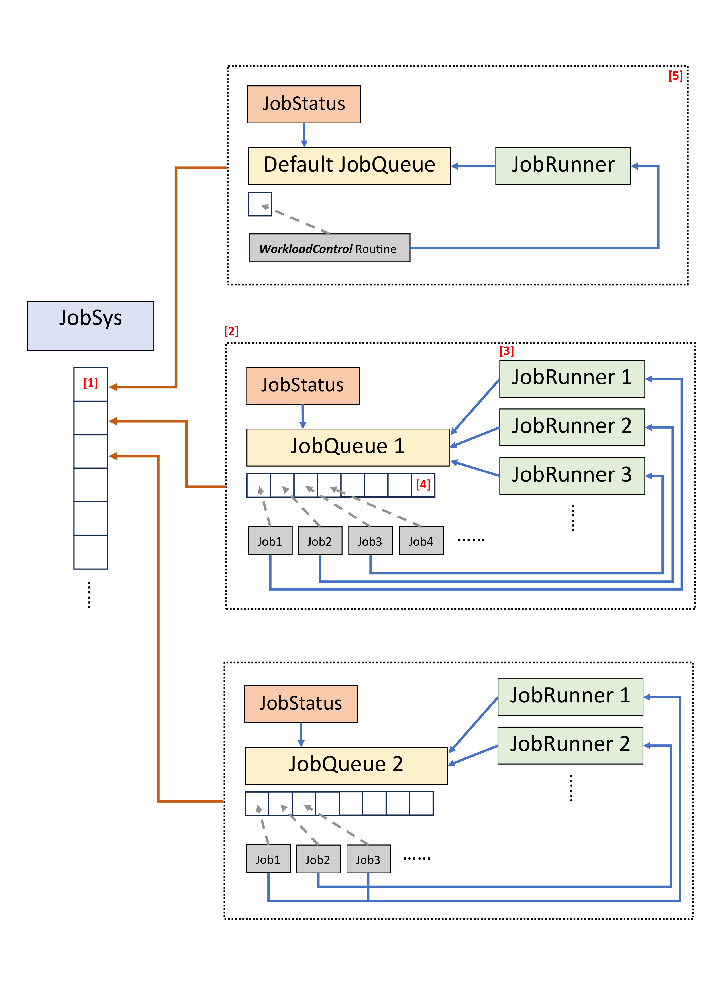

# 轻量级游戏引擎 - 技术文档

英文版项目文档可见此链接:
[English](TechDoc.md)


## 目录

+ [渲染管线](#RenderingPipeline)

+ [物理系统](#PhysicsSystem)

+ [资产管线](#AssetPipeline)

+ [任务队列系统](#JobSystem)

+ [通用组件](#Utility)
    - [单例](#Singleton)
    - [智能指针](#SmartPointers)

+ [数学库](#Math)
    - [Mathf](#Mathf)
    - [向量](#Vector)
    - [矩阵](#Matrix)


<br></br>
<a id="RenderingPipeline"></a>

# 渲染管线

游戏引擎实现了一个跨平台的渲染管线。该渲染管线同时支持 **x64** 和 **Win32** 平台。在x64平台下渲染管线使用了 **Direct3D 12** 作为渲染后端；而在 Win32 平台下，渲染管线使用了 **OpenGL 4.6** 作为渲染后端。
由于在不同平台上使用了不同的渲染后端和逻辑，为此渲染管线对其底层逻辑进行了封装，并为外部系统的调用提供了通用、独立于平台的接口。


## 架构设计

为了方便理解，下面附上渲染管线的架构图：


+ 从渲染管线的视角来看，游戏引擎可以分为两个部分：*“应用端”* 和 *“渲染端”*。应用端和渲染端采用了 **生产者-消费者设计模式（Producer-Consumer Design Pattern）**，其中应用端作为生产者负责计算并“生产”渲染数据，而渲染端则作为消费者使用这些数据来渲染游戏画面。

+ 应用端和渲染端各自维护着一个独立的线程。应用端在 *“主线程（main thread）”* 上运行，该线程负责游戏逻辑执行和除渲染外的所有其他引擎功能。相对应地，渲染端在 *“渲染线程（rendering thread）”* 上运行，其专门负责所有与渲染相关的任务。

+ 在游戏引擎初始化时，主线程负责初始化游戏引擎所有的系统，这其中包括了渲染端。此外也是主线程负责为渲染端创建一个新的线程来作为渲染线程。     

+ 完成初始化后，主线程进入引擎的主循环（main loop）。主循环专门用于运行整体的引擎功能和游戏逻辑。主循环更新可以进一步划分为 *“系统更新”（System Update）* 和 *“模拟更新”（Simulation Update）*。
    - 模拟更新负责的是对游戏逻辑的逐帧更新，例如物理更新，摄像机更新，gameplay更新等。模拟更新的频率与游戏的帧率同步，且可以由用户自定义。
    - 另一方面，系统更新负责执行引擎系统的功能，例如监听用户输入，更新UI，向渲染端提交渲染数据等。系统更新的频率与CPU时钟周期（CPU clock cycle）同步。
    - 系统更新和模拟更新不一样的迭代频率可能会引发一些渲染问题。以渲染一个移动的模型为例，模型的变换矩阵由模拟更新负责计算，每一帧才会更新一次（大多数游戏使用30FPS或60FPS的帧率）。但系统更新会在每个CPU时钟周期向渲染端提交模型的变换矩阵进行渲染。如果系统更新直接向渲染端提交由模拟更新计算得到的变换矩阵，那么渲染得到的模型移动将会是断断续续的。

        对这类问题的解决方案是基于系统时间计算渲染数据的预测值，并将这些预测数据而不是原始数据提交给渲染端进行渲染。

    - 在目前的实现中，需要提交的渲染数据包括了：系统时间、摄像机信息、每个游戏对象的网格、着色器和变换矩阵等。

+ 渲染数据提交至渲染端后，后续的渲染步骤由渲染端负责处理。与应用端类似，渲染端完成了自身的初始化后会进入渲染循环（Render loop），负责游戏运行期的画面渲染。如前所述，应用端和渲染端分别充当了渲染数据的“生产者”和“消费者”，而游戏引擎使用了两个不同的线程来运行应用端和渲染端，致使应用端和渲染端之间存在线程同步问题。为此，作为数据消费者的渲染线程会在每一个渲染周期阻塞地等待应用端完成渲染数据的提交后，再对数据进行渲染。
    - 但是，使用阻塞机制进行同步并不是一个很好的设计，因为这会极大地拖慢引擎的运行性能。然而其优点在于实现相对简单，线程安全性较好且更易于维护。考虑到该游戏引擎的架构相对简单，因此采用了这种设计来实现应用端和渲染端的同步。

+ 渲染端维护着两个用来暂存渲染数据的缓冲区，分别是：*“接收缓冲区（Receiver Buffer）”* 和 *“渲染缓冲区（Render Buffer）”*。接收缓冲区负责接收应用端提交的渲染数据，而渲染缓冲区则将渲染数据从操作系统的内存中提交到GPU的内存进行渲染。在一个渲染周期中，应用端计算好的渲染数据会首先被提交到接收缓冲区进行暂存。在应用端完成所有数据的提交后，渲染管线会把渲染数据从接收缓冲区迁移到渲染缓冲区。完成数据转移后，接收缓冲区会继续接收应用端提交的用于下一个周期的渲染数据，而渲染缓冲区则会把当前周期的渲染数据提交给GPU进行渲染。
    - 考虑到当前的渲染管线采用阻塞等待的方法接收数据，单一缓冲区就足以从应用端接收并随后提交数据给GPU。而选择使用双缓冲区的设计是考虑到在未来的更新中，届时渲染管线可能从单线程转为多线程。对于多线程渲染管线，若只采用一个缓冲区完成上述步骤，那么正在被提交给GPU的数据很可能会被应用端提交的新数据给覆盖，因此需要双重或甚至多重缓冲区的设计。
    
+ 在渲染缓冲区完成数据提交后，渲染管线最后调用图形库的绘制命令进行画面的渲染。


+ ## 渲染组件

    为了支持渲染管线的运作，该游戏引擎实现了渲染数据类，例如网格类（mesh class），效果类（effect class），常缓冲区类（constant buffer class）。由于渲染管线是跨平台的，因此这些渲染组件的底层逻辑也采用了跨平台实现并进行了封装，只对外暴露了平台独立（platform-independent）的接口以供调用。

    此外，如前所述渲染管线采用了 “生产者-消费者” 设计模式，因而渲染数据在渲染管线的运行过程中涉及了大量的迁移。为了更好地管理渲染数据的创建、拷贝、迁移和清理，渲染数据使用了 **观察者设计模式（Observer Design Pattern）** 进行开发。


## APIs
```cpp

/* Initialize the rendering pipeline and graphics library */
cResult Initialize( const sInitializationParameters& );

/* Subtmit system tick and simulation tick for rendering */
void SubmitElapsedTime( float, float );

/* Submit the color data to clear the last frame (also set the background for this frame) */
void SubmitBackgroundColor( float, float, float, float = 1.0f );

/* Submit the transform matrix of camera of this frame */
void SubmitCameraMatrices( Math::cMatrix_transformation, Math::cMatrix_transformation );

/* Submit rendering data of this frame */
cResult SubmitNormalRenderData(ConstantBufferFormats::sNormalRender[], uint32_t );

/* Submit rendering data for debug of this frame */
cResult SubmitDebugRenderData(ConstantBufferFormats::sDebugRender[], uint32_t );

/* This is called (automatically) from the main/render thread. 
   It will render a submitted frame as soon as it is ready */
void RenderFrame();

```


<br></br>
<br></br>
<a id="PhysicsSystem"></a>

# 物理系统

物理系统包含了多个组件，包括物理对象的实现、刚体动力学的模拟，以及碰撞检测和解决机制。

该物理系统实现了包括 **变换（transform）**、**刚体（rigid bodies）** 和 **碰撞器（collider）** 在内的物理对象。

对于碰撞检测，该物理系统实现了碰撞检测的 **碰撞初筛（broad phase）** 和 **碰撞细筛（narrow phase）**。在碰撞初筛检测中，物理引擎实现了 **Sweep And Prune** 算法和 **包围体层次结构（BVH）** 算法，用户可以根据实际的运行需求来决定使用哪一种算法。

对于碰撞解决，物理系统采用了基于解坐标约束的碰撞解决机制。此外，物理系统实现了针对动态碰撞器（dynamic collider）、静态碰撞器（static collider）和触发器碰撞器（trigger collider）提供了特定的碰撞解决策略，以应对这些对象类型之间不同的需求和相互作用。


## 架构设计

为了方便理解，下面附上渲物理系统的流程图：


对于物理系统具体的描述仍在撰写中。


## APIs
```cpp

/* Initialize the physicis system */
void Initialize( const std::vector<cCollider*>&, uint8_t );

/* Detect if two collider overlap with each other */
bool IsOverlaps(cCollider* i_lhs, cCollider* i_rhs);

/* Update the collision detection status of the physics system */
void Update_CollisionDetection();

/* Update the collision resolution status of the physics system */
void Update_CollisionResolution();

/* Add a new collider to the physics system */
void RegisterCollider( cCollider* );

/* Remove a existing collider from the physics system */
cResult DeregisterCollider( cCollider* );

```


<br></br>
<br></br>
<a id="AssetPipeline"></a>

# 资产管线

从某种角度来说，游戏引擎可以理解为负责为游戏的开发和运行提供所需的特定功能的库。因此对于游戏引擎来说，游戏资产（例如gameobject，mesh，shader，user data等）都属于外部数据。游戏引擎充当这些数据的“消费者”。因此，这些数据不应硬编码到游戏引擎的源代码中。相反，它们应存储在磁盘上并在运行时加载到游戏中。资产管线的主要作用是监督和管理游戏资产从创建、到存储、再到加载到游戏中的整个过程。

与渲染管线一样，资产管线也构成了一个复杂的系统。但资产管线比较特殊的地方在于，其许多功能不会直接作用与游戏中。此外，一些游戏资产来源于外部软件（例如，模型资产来自3D建模软件 **Maya**）。因此，资产管线也专门实现了外部软件的插件以对资产进行管理。


## 架构设计

为了方便理解，以下部分以资产管线对模型资产的管理为例，展示了资产管线的架构和流程。


+ 当前的游戏引擎使用由Maya生产的模型。由于Maya对于游戏引擎来说属于外部的第三方软件，因此资产管线需要使用插件来从Maya中提取模型数据。Autodesk，Maya的母公司，为开发人员提供了SDK和API，如 **Maya Devkit** 和 **OpenMaya**。当前的游戏引擎使用了这些SDK实现了一个能够从Maya中提取模型数据的插件。游戏引擎会在构建期（build-time）对插件进行编译构建，然后由用户载入到Maya中。

+ 当游戏美术（game artist）和技术美术（technical artist）完成对模型的创建和修改后。用户可以使用插件导出模型数据。在当前的实现中，插件会从Maya中导出模型的顶点位置（vertex position），法向量（normal），切线值（tangent），顶点颜色（vertex color），以及顶点索引的构成顺序（vertex index winding order）。最后插件会把Maya模型导出为 .lua 格式的模型文件。
    - 为何将模型导出为.lua文件？虽然 .lua 作为一种人类可读的文件格式（human-readable file format），在序列化/反序列化效率和安全性方面有局限性，但其可读性良好，且易于开发人员进行维护和调试。
    
        以模型资产为例。在游戏开发过程中，包括游戏美术、技术美术和游戏工程师在内的各种职位将合作开发模型。在这个阶段，数据的可读性、可维护性和可调试性是至关重要的，因此采用人类可读文件格式来保存数据更为合适。当开发阶段结束，数据已经定型后，重点就转向数据的易处理性，易保存性和安全性。在这个阶段，使用二进制文件格式存储数据是最佳的。

+ 完成Maya模型的导出后，模型文件会被存放在电脑磁盘中，或是版本管理系统中（source control）。在游戏的构建期（build-time），游戏引擎专门用于处理模型数据的模块 *“MeshBuilder”* 将从磁盘上加载 .lua 模型文件，并对模型数据进行预处理。
    -  如：Maya模型的顶点索引构成顺序（vertex index winding order）默认采用了右手系顺序。由于游戏引擎的渲染管线在x64平台支持Direct3D，在Win32平台支持OpenGL，Direct3D使用左手系顺序。因此 MeshBuilder 会在预处理时把输出至 x64 平台的模型资产的索引顺序改为左手系顺序。

+ 在预处理阶段之后，MeshBuilder 会把模型数据编译为二进制数据，并导出为 .mesh 格式的二进制模型文件。
    - 注：.mesh 是一个自定义的文件扩展名。采用 .mesh 作为模型文件拓展名是为了方便用户对多种游戏资产文件进行管理。用户可以根据自身需求使用其他名字作为模型文件的拓展名。


<br></br>
<br></br>
<a id="JobSystem"></a>

# 任务队列系统

任务队列系统设计为使用多线程技术来管理游戏引擎各项任务的执行。

任务队列系统为用户提供了一系列API，以便管理任务的执行和任务队列系统本身的运行。用户可以以根据运行时的需求动态地增加任务队列（Job Queue）并指派任务执行单元（Job Runner），从而提高游戏引擎的性能。此外，用户可以根据任务队列系统的工作负载删除多余的任务队列和空闲的任务执行单元，以优化游戏引擎的资源利用。

此外，任务队列系统实现了一个自动化工作负载调整机制。当创建新的任务队列时，用户可以选择是否在任务队列上应用此机制。该机制根据任务队列中待处理任务的数量动态地创建或删除任务执行单元。从而确保了资源利用和任务执行效率之间的最佳平衡。

在进一步介绍任务队列系统之前，首先介绍需要其基础组件。


## 构成组件

任务队列系统的实现使用了以下组件。其中一些组件除了在任务队列系统，也可以应用在其他开发场景中，如 `互斥锁（Mutex）`、`局域锁（ScopeLock）`、`事件（Event）` 等。用户可根据特定的开发需求使用。

+ [哈希字符串（Hashed String）](#HashedString)
+ [可等待对象（Waitable Objects）](#Waitable)
+ [任务对象（Job）](#Job)
+ [任务队列（Job Queue）](#JobQueue)
+ [任务执行单元（Job Runner）](#JobRunner)
+ [任务队列管理器（Job Queue Manager）](#JobQueueManager)
+ [工作负载管理器（Workload Manager）](#WorkloadManager)


<a id="HashedString"></a>

+ ### 哈希字符串（Hashed String）
    哈希字符串对象存储了一个整型哈希值，该值是采用 **FNV哈希算法** 对字符串计算得出的。在任务队列系统的上下文中，哈希字符串对象用作每个任务队列的唯一标识符，确保其在任务队列系统中的唯一性。


<a id="Waitable"></a>

+ ### 可等待对象（Waitable Objects）

    - #### 事件（Event）
        事件对象是一种同步对象，其状态可以通过使用 *"Signal()"* 函数明确设置为激活状态。一个事件可以是`手动重置事件（ManualResetEvent）`，或是`自动重置事件（ManualResetEvent）`。

        当手动重置事件对象被激活时，它会一直保持着激活状态（signaled），直到它被重置函数明确设置为关停状态（reset）。任何数量的等待中线程，在事件对象的状态被激活时方可被释放。当自动重置事件对象被激活时，它会先维持着激活状态，一旦有等待中的线程被释放，系统会自动把事件对象重置为关停状态。如果事件对象被激活时没有线程在等待，那么事件对象会一直保持着激活状态。

        请查看 [Windows事件对象](https://learn.microsoft.com/en-us/windows/win32/sync/event-objects) 了解更多详情。

    - #### 互斥锁（Mutex）
        互斥锁对象是一种同步对象，当它没有被任何线程占用时，其状态会被设置为激活状态，而当它被某个线程拥占用时，其状态会变为关停状态。同一时间下只能有一个线程可以占用互斥锁对象。

        互斥锁对象在协调对共享资源的互斥访问时很有用。需要注意的是，临界区对象（critical section）提供了与互斥锁对象相似的同步功能，但临界区对象只能由同一个进程中的线程使用。

        请查看 [Windows互斥锁对象](https://learn.microsoft.com/en-us/windows/win32/sync/mutex-objects) 了解更多详情。

    - #### 信号量（Semaphore）
        信号量对象是一种同步对象，它维护一个在零和指定最大值之间的计数。每当有线程开始对信号量对象占用时，计数减一；每当有线程释放信号量时，计数加一。当计数达到零时，其余的线程在不可占用信号量对象。当信号量的计数大于零时，其状态会设置为激活状态，而当计数为零时，其状态会重置为关停状态。

        信号量对象在控制可以支持有限数量用户的共享资源时很有用。它的机制类似一个门，限制着能够共享资源的最大线程数量。如果有多于一个线程正在等待信号量对象，信号量对象将选择一个任意的等待线程。其选择规律并不遵循先进先出（FIFO）的顺序。

        请查看 [Windows信号量对象](https://learn.microsoft.com/en-us/windows/win32/sync/semaphore-objects) 了解更多详情。

    - #### 局域锁（ScopeLock）
        局域锁对象是一种同步对象，它维护着一个指向互斥锁对象的指针。

        当实例化范围锁对象时，对象会试图获得与之关联的互斥锁的所有权。如果互斥锁当前被另一个线程拥有，则范围锁对象的实例化将会进入阻塞等待，直到互斥锁被释放。范围锁在其生命周期内持有互斥锁的所有权。在范围锁对象析构时时，互斥锁会被自动释放。

        通过这种机制，范围锁对象在防止线程产生死锁时很有用。


<a id="Job"></a>

+ ### 任务对象（Job）
    任务对象是一种数据结构，其存储要由任务执行单元执行的特定任务（该任务是由用户指定的）。任务对象使用了 **观察者设计模式（Observer design pattern）** 实现。因此任务对象的实例化必须通过其接口所提供的"工厂"函数来完成。任何在接口定义外的对任务对象的实例化和拷贝都会导致未知的错误。


<a id="JobQueue"></a>

+ ### 任务队列（JobQueue）
    任务队列对象是一种数据结构，负责存储和管理任务对象。在任务队列内部的任务对象按先进先出（FIFO）的顺序执行。

    任务队列对象可能管理着多个并行的任务执行单元。为了便于对同一个任务队列上的任务执行单元进行同步，任务队列对象维护一个 `CONDITION_VARIABLE` 对象和一个 `CRITICAL_SECTION` 对象。这确保了任务对象能够以同步的方式添加到队列并从队列中检索。

    与任务对象类似，任务队列对象也使用了**观察者设计模式**实现。任何在接口定义外的对任务队列对象的实例化和拷贝都会导致未知的错误。


<a id="JobRunner"></a>

+ ### 任务执行单元（JobRunner）
    如其名字所示，任务执行单元对象是任务队列中执行任务的最基本单元。它同时也是具体负责执行任务的线程的控制模块。
    
    每个任务执行单元对象存储了线程的基本数据，包括指向线程的句柄，线程ID，以及指向其所属任务队列的指针。


<a id="JobQueueManager"></a>

+ ### 任务队列管理器（Job Queue Manager）
    任务队列管理器充当着任务队列对象的管理者。任务队列管理器负责监督任务队列中所有构成组件，包括任务队列对象、任务状态对象（JobStatus）、任务队列所属的任务执行单元和一个工作负载管理器对象。


<a id="JobQueueManager"></a>

+ ### 工作负载管理器（WorkloadManager）
    工作负载管理器充当者任务队列系统内每个任务队列的工作负载管理模块。当用户启用 *"自动化负载调整"* 功能时，工作负载管理器会根据游戏引擎的实时工作量动态地为任务队列分配或移除任务执行单元。从而优化游戏引擎的性能。


## 架构设计

为了方便对任务队列系统架构的理解，以下是任务队列系统简易的架构图，概述了其关键组件及之间的相互运作。




+ **[1]:** 任务队列系统使用 `unordered_map` 来记录所有的任务队列。字典中的每个映射元素都存储了一个指向 `JobQueueManager` 对象的指针，而字典元素的键值是HashedString，它将作为每个任务队列的唯一标识符。

+ **[2]:** 任务队列是任务队列系统中任务调度的基本单位。而每个任务队列都管理多个任务执行单元，这些任务执行单元是任务队列内负责任务执行的最基本单位。

+ **[3]:** 需要注意的是，每个任务队列在运行时必须拥有至少一个任务执行单元。创建新的任务队列时，任务队列系统将默认为队列添加一个任务执行单元。当用户手动从任务队列中删除任务执行单元时，如果队列中只存在一个任务执行单元，那么删除操作将不会被执行。

+ **[4]:** 任务队列对象维护着一个队列（queue）来跟踪所有已调度的任务，以及一个标志（flag）来记录任务队列的状态。这些组件被设计为任务队列内的线程共享资源，并受到任务队列维护的临界区对象的保护以确保同步访问。

+ **[5]:** 在初始化期间，任务队列系统将自动创建一个默认任务队列。默认任务队列是任务队列系统内的一个私有任务队列，其专门设计用来处理任务队列系统本身的运行。此外，默认任务队列还负责运行自动工作负载调整机制。


## 自动化工作负载调整（Automatic Workload Adjustment） 

在游戏引擎的运行期中，任务队列需要执行的任务数量可能会随时间而变化。在一方面，如果有太多的任务等待被执行却没有足够的任务执行单元去消化这些任务，这回导致游戏性能下降。而在另一方面，如果任务执行单元的数量远远超出实际需求，那些闲置的任务执行单元将对系统资源造成。找到任务执行单元的需求和供应之间的平衡，以优化程序性能和资源利用至关重要。

当前的自动化工作负载调整机制提供了一种简单的策略来解决上述问题。每个任务队列都维持着一个 `工作负载管理器` 用于工作负载调整。工作负载管理器记录着其对应的任务队列的工作负载状态。工作负载管理器使用两个状态来标识工作负载状态：队列中的任务是否太多或太少。这些状态是基于正在等待被执行的任务数量与之相应的阈值之间的比较来切换的。任务队列系统的私有任务队列会循环地执行一个检测程序，其会不断地检查每个工作负载管理器的状态，并相应地动态调整任务执行单元的数量，根据运行需求添加或删除它们。


## APIs
```cpp

/* Initialize the job system and create a default job queue */
void Init();

/* Create a new job queue with the given name and return the hashed job queue name. If a job 
   queue with the same hashed name already exists, return the hashed name directly instead. 
   A job queue must have at least one job runner. If the user creates a job queue with a 
   "runnerNum" value of 0, this function will automatically create a job runner. */
HashedString CreateQueue(const string& queueName, unsigned int runnerNum = 1, bool autoFlowControl = false);

/* Add a job runner thread to the specified job queue. */
void AddRunnerToQueue(JobQueueManager* manager);

/* Add a job runner thread to the specified job queue. Return true if the job queue exists and
   the adding is successful. Otherwise, return false. */
bool AddRunnerToQueue(const HashedString& queueName);

/* Register a job to the specified job queue. Returen true if the job queue exists and the
   adding is successful. Otherwise, return false. */
bool AddJobToQueue(const HashedString& queueName, function<void()> jobFunction, const string& jobName = std::string());

/* Remove the first job runner from the specified job queue. The job queue must have at least
   one job runner; otherwise, the removal will have no effect and return false. */
bool RemoveRunnerFromQueue(JobQueueManager* manager);

/* Remove the first job runner from the specified job queue. The job queue must have at least
   one job runner; otherwise, the removal will have no effect and return false. */
bool RemoveRunnerFromQueue(const HashedString& queueName);

/* Remove the specified job queue from the job system. Return true if the job queue exists and
   the removal is successful. Otherwise, return false. */
bool RemoveQueue(const HashedString& queueName);

/* Get the specified job queue with given queue hashed name. Return a null pointer if the job
   queue does not exist. */
JobQueueManager* GetQueue(const HashedString& queueName);

/* Check if the specified job queue exists and has unfinished jobs. */
bool IsQueueHasJobs(const HashedString& queueName);

/* Request the job system to terminate. */
void RequestStop();

bool IsStopped();

```


<br></br>
<br></br>
<a id="Utility"></a>

# 通用组件

关于单例和智能指针的详细描述，可以参考[英文版技术文档](./TechDoc.md#Utility)中的通用组件章节。

<a id="Singleton"></a>

## 单例

<a id="SmartPointers"></a>

## 智能指针


<br></br>
<a id="Math"></a>

# 数学库

关于数学库的详细描述，可以参考[英文版技术文档](./TechDoc.md#Math)中的数学库章节。

<a id="Mathf"></a>

## Mathf.h
 
<a id="Vector"></a>

## 向量

<a id="Matrix"></a>

## 矩阵